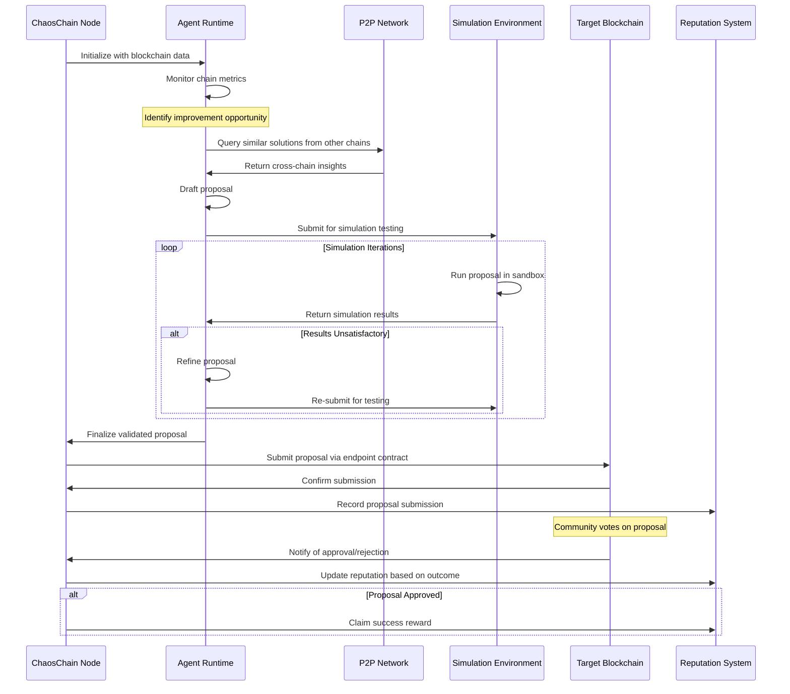
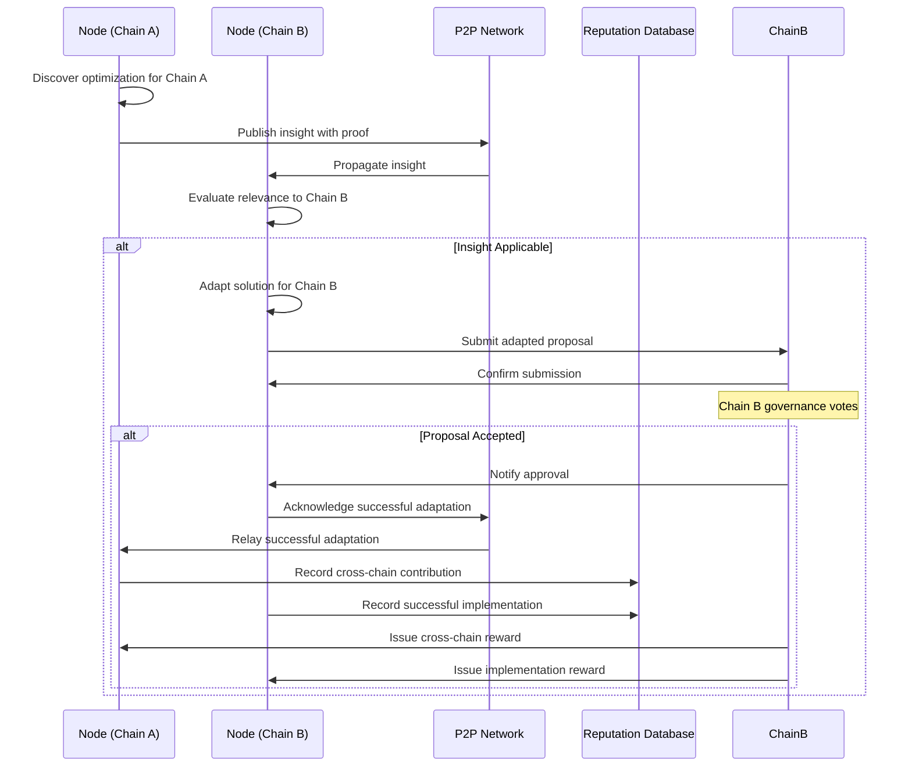

# ChaosChain Governance OS: Implementation Plan

## Project Overview & Scope

ChaosChain is a cross-chain agentic governance operating system designed to enhance blockchain governance through AI-driven agents. Unlike traditional blockchain projects that operate as L1/L2 networks, ChaosChain functions as an overlay meta-layer that integrates with existing blockchains to augment their governance and core development processes.

**Core Value Proposition:**
- Accelerate blockchain evolution through AI-assisted governance and development
- Enable cross-chain knowledge sharing and improvement propagation
- Provide rigorous simulation-based validation for protocol changes
- Lower the barrier to quality governance for smaller blockchain ecosystems

**Scope Boundaries:**
- **In Scope:** Off-chain agent infrastructure, P2P network, on-chain integration contracts, simulation environment, reputation system, incentive mechanisms
- **Out of Scope:** Modifications to existing blockchain consensus mechanisms, creation of a new blockchain, token issuance

## High-Level Architecture

ChaosChain is composed of several interconnected systems that work together to deliver AI-enhanced governance across multiple blockchains:

```
┌─────────────────────────────────────────────────────────────────────┐
│                        ChaosChain Node                               │
│                                                                     │
│   ┌─────────────┐    ┌──────────────┐    ┌───────────────────────┐  │
│   │ Agent       │    │ P2P          │    │ Blockchain Endpoint   │  │
│   │ Runtime     │◄─┐ │ Communication│    │ Client                │  │
│   │ - LLM Core  │  │ │ Layer        │    │ - Chain adapters      │  │
│   │ - Tools     │  │ │              │    │ - Transaction signing │  │
│   └─────────────┘  │ └──────────────┘    └───────────────────────┘  │
│         ▲          │        ▲                       ▲               │
│         │          │        │                       │               │
│   ┌─────┴──────────┴─┐    ┌─┴──────────┐      ┌────┴──────────────┐ │
│   │ Simulation       │    │ Reputation │      │ Incentive         │ │
│   │ Environment      │    │ System     │      │ Mechanism         │ │
│   └──────────────────┘    └────────────┘      └───────────────────┘ │
└─────────────────────────────────────────────────────────────────────┘
                                   │
                                   ▼
┌─────────────────────────────────────────────────────────────────────┐
│                     Integration Layer                                │
│                                                                     │
│  ┌────────────────┐  ┌────────────────┐  ┌────────────────────────┐ │
│  │ Ethereum       │  │ Arbitrum       │  │ Bitcoin                │ │
│  │ Smart Contract │  │ Smart Contract │  │ Off-chain Adapter      │ │
│  └────────────────┘  └────────────────┘  └────────────────────────┘ │
└─────────────────────────────────────────────────────────────────────┘
```

### Major Components

1. **Agent Runtime**
   - LLM-based inference engine for governance agents
   - Domain-specific tools for blockchain analysis and proposal generation
   - Secure execution environment (TEE/zkML)
   - Policy constraints to ensure safe operation

2. **P2P Communication Layer**
   - Decentralized messaging protocol
   - Agent coordination mechanics
   - Cross-chain insight sharing
   - Peer discovery and network topology management

3. **Blockchain Endpoint Client**
   - Chain-specific adapters for multiple blockchains
   - Transaction signing and submission
   - Event monitoring and data collection
   - RPC/API interfaces

4. **On-chain Integration Modules**
   - Minimal smart contracts deployed on target chains
   - Proposal submission interfaces
   - Reputation attestation
   - Agent identity verification

5. **Off-chain Adapters**
   - For blockchains without smart contract capabilities
   - Forum/GitHub API integrations for off-chain governance
   - Data collection from non-programmable chains

6. **Reputation System**
   - Performance tracking database
   - Cryptographic attestation mechanisms
   - Time-weighted scoring algorithms
   - Domain-specific expertise tracking

7. **Simulation Environment**
   - Forked chain testing environments
   - Accelerated simulation capabilities
   - Adversarial testing frameworks
   - Performance metric collection

8. **Incentive Mechanism**
   - Multi-chain reward distribution
   - Fee calculation and payment processing
   - Cross-chain contribution tracking
   - Optional staking implementations

## Module Breakdown & Directory Structure

```
chaoschain-governance-os/
├── README.md
├── IMPLEMENTATION_PLAN.md
├── docs/
│   ├── architecture/
│   ├── apis/
│   └── integration-guides/
├── agent/
│   ├── runtime/              # Agent execution environment
│   ├── models/               # LLM integration and fine-tuning
│   ├── tools/                # Chain-specific and general tools
│   └── policies/             # Safety and operational policies
├── p2p/
│   ├── protocol/             # P2P messaging protocol definition
│   ├── discovery/            # Peer discovery mechanisms
│   └── transport/            # Transport layer implementations
├── blockchain-clients/
│   ├── ethereum/             # Ethereum client implementation
│   ├── arbitrum/             # Arbitrum client implementation
│   ├── solana/               # Solana client implementation
│   └── bitcoin/              # Bitcoin client implementation
├── integration/
│   ├── contracts/            # Smart contract integration points
│   │   ├── ethereum/
│   │   ├── arbitrum/
│   │   └── solana/
│   └── adapters/             # Off-chain integration adapters
│       ├── bitcoin/
│       └── forum-apis/       # GitHub, forums, etc.
├── reputation/
│   ├── scoring/              # Reputation scoring algorithms
│   ├── storage/              # Reputation database
│   └── attestation/          # Cryptographic proof mechanisms
├── simulation/
│   ├── environments/         # Chain-specific simulation environments
│   ├── scenarios/            # Test scenarios and benchmarks
│   └── metrics/              # Performance monitoring tools
├── incentives/
│   ├── calculation/          # Reward calculation logic
│   ├── distribution/         # Payment distribution mechanisms
│   └── verification/         # Contribution verification
├── node/
│   ├── cli/                  # Node operator command line interface
│   ├── config/               # Node configuration
│   ├── services/             # Core node services
│   └── api/                  # Node API endpoints
└── tests/
    ├── unit/
    ├── integration/
    ├── e2e/
    └── fuzz/                 # Fuzzing and security tests
```

## Tech Stack Choices

### Core Technologies

| Component | Technology Choice | Justification |
|-----------|-------------------|---------------|
| **Agent Runtime Core** | Rust + Python | Rust for performance-critical components with Python for LLM integration. Rust provides memory safety and concurrency guarantees, while Python offers rich ML libraries and easier LLM integration. |
| **P2P Layer** | libp2p + Rust | libp2p is battle-tested in decentralized systems (IPFS, Ethereum 2.0), has multiple language bindings, and provides modular networking primitives. Rust implementation offers security and performance. |
| **Blockchain Clients** | Ethers.js/web3.js (TS) + Rust | Typescript with established blockchain libraries for rapid development of chain interfaces. Performance-critical components in Rust. |
| **Smart Contracts** | Solidity + Vyper | Industry-standard languages for EVM chains with Vyper for additional safety. Chain-specific languages (e.g., Solana's Rust) as needed. |
| **Simulation Environment** | Docker + Hardhat/Anvil | Containerized test environments with established chain testing frameworks. Enables reproducible and isolated testing. |
| **Reputation System** | PostgreSQL + Redis | PostgreSQL for reliable, ACID-compliant reputation data storage with Redis for caching frequent operations. |
| **Trusted Execution** | Intel SGX / AMD SEV | Hardware TEE to ensure agent execution integrity with future zkML capabilities as technology matures. |
| **Development Environment** | TypeScript + Rust | Type-safe development with excellent tooling support. |

### Frontend & Tooling

| Component | Technology Choice | Justification |
|-----------|-------------------|---------------|
| **Node Dashboard** | React + TypeScript | Modern, component-based UI development with type safety. |
| **Monitoring & Analytics** | Prometheus + Grafana | Industry standard for metrics collection and visualization. |
| **CI/CD** | GitHub Actions | Seamless integration with repository and broad ecosystem support. |
| **Testing** | Jest (TS) + Rust Test Framework | Comprehensive testing with native frameworks for each language. |

## Data Flow / Sequence Diagrams

### Agent Proposal Generation & Submission



### Cross-Chain Knowledge Sharing



## Milestones & Deliverables

### Phase 1: Research & Foundation (Months 1-3)

| Milestone | Deliverables | Description |
|-----------|--------------|-------------|
| **Technology Exploration** | Research report, PoC architecture | Exploration of LLM capabilities, TEE options, and blockchain integration patterns |
| **Architecture Definition** | Detailed technical specs, API definitions | Finalize component interfaces and data models |
| **Core Infrastructure** | Repository setup, CI/CD pipelines, dev environments | Essential development infrastructure |
| **Agent PoC** | Basic agent prototype with chain monitoring | Demonstrate basic chain monitoring and proposal generation |

### Phase 2: MVP Development (Months 4-6)

| Milestone | Deliverables | Description |
|-----------|--------------|-------------|
| **P2P Layer Implementation** | Working P2P communication module | Implement basic agent communication protocol |
| **Ethereum Integration** | Ethereum endpoint contract + client | First blockchain integration targeting Ethereum |
| **Basic Simulation** | Simple forked chain simulation environment | Capability to test proposals in isolated environment |
| **Basic Agent v1** | Functional agent that can monitor and propose | First end-to-end flow from monitoring to proposal |

### Phase 3: Testnet Launch (Months 7-9)

| Milestone | Deliverables | Description |
|-----------|--------------|-------------|
| **Multi-Chain Support** | Arbitrum and one non-EVM integration | Demonstrate cross-chain capabilities |
| **Reputation System v1** | Working reputation tracking and API | Track agent performance and build credibility system |
| **Enhanced Simulation** | Advanced scenario testing, metrics | Robust proposal validation with comprehensive metrics |
| **Incentive Mechanism** | Reward distribution implementation | Economic layer for sustainable operation |
| **Testnet Deployment** | Live system on multiple test networks | Public demonstration of capabilities |

### Phase 4: Production & Expansion (Months 10-12)

| Milestone | Deliverables | Description |
|-----------|--------------|-------------|
| **Security Audits** | Audit reports, vulnerability fixes | Third-party security validation |
| **Enhanced TEE Integration** | Secure agent execution environment | Trustless agent operation guarantees |
| **Mainnet Beta** | Limited mainnet deployment | Controlled production testing |
| **Additional Chain Support** | 3+ new blockchain integrations | Expand ecosystem coverage |
| **Community Tools** | Operator dashboard, analytics | Tools for node operators and governance participants |
| **Full Launch** | Production-ready system | Complete governance OS deployment |

## Testing & Security Approach

### Testing Strategy

| Test Type | Tools | Coverage Goals |
|-----------|-------|---------------|
| **Unit Testing** | Jest (TS), Rust Test Framework | 90%+ code coverage of all critical components |
| **Integration Testing** | Custom test harnesses | Verify correct interaction between components |
| **End-to-End Testing** | Simulated blockchain environments | Validate complete proposal lifecycle |
| **Fuzz Testing** | Rust fuzzing tools, custom fuzzers | Identify edge cases and unexpected inputs |
| **Security Testing** | Static analysis, dependency scanning | Detect common vulnerabilities |
| **Performance Testing** | Load generation, benchmarking | Ensure system meets throughput requirements |
| **Simulation Testing** | Forked chain environments | Validate proposal effects match predictions |

### Security Measures

1. **Trusted Execution Environment (TEE)**
   - Utilize Intel SGX or AMD SEV for secure agent execution
   - Implement remote attestation to verify agent integrity
   - Secure key management for agent identity

2. **zkML Integration (Future)**
   - Research and implement zero-knowledge proofs for model execution
   - Enable verifiable inference without revealing model details

3. **Smart Contract Security**
   - Formal verification of critical contracts
   - Multiple independent security audits
   - Minimal on-chain footprint to reduce attack surface

4. **Agent Safeguards**
   - Policy-based constraints on agent actions
   - Multi-stage approval for critical operations
   - Simulation validation before any on-chain submission

5. **Censorship Resistance**
   - P2P network resilience against denial of service
   - Multiple redundant communication paths
   - Decentralized agent operation

## Open Questions & Risks

### Technical Questions

1. **LLM Selection & Customization**
   - Which base LLM provides the best balance of performance and cost?
   - What fine-tuning approach will best adapt LLMs to blockchain governance?
   - How to quantify and minimize hallucination risk in proposal generation?

2. **TEE/zkML Implementation**
   - How to balance security guarantees with computational requirements?
   - What is the development timeline for production-ready zkML?
   - How to handle TEE vulnerabilities if discovered?

3. **Cross-Chain Data Models**
   - What canonical representation should be used for cross-chain concepts?
   - How to efficiently translate between chain-specific data structures?

### Business & Operational Risks

1. **Blockchain Community Adoption**
   - Will established blockchains be willing to integrate ChaosChain?
   - What governance changes are needed for communities to accept AI proposals?

2. **Incentive Alignment**
   - How to ensure economic incentives don't lead to proposal spam?
   - What is the sustainable funding model for node operation?

3. **Regulatory Considerations**
   - How might AI governance agents be viewed by regulators?
   - What compliance requirements might affect operation in different jurisdictions?

4. **Technical Debt Management**
   - How to manage multiple blockchain interfaces as protocols evolve?
   - What abstraction layers will minimize maintenance overhead?

### Product Owner Input Needed

1. **Integration Prioritization**
   - Which blockchains should be targeted first for maximum impact?
   - What specific governance pain points should initial agents focus on?

2. **Success Metrics**
   - How do we measure the effectiveness of governance improvements?
   - What quantitative goals should be set for proposal quality and adoption?

3. **Go-to-Market Strategy**
   - How to approach blockchain communities for initial adoption?
   - What partnerships would accelerate integration?

4. **Security vs. Speed Tradeoffs**
   - What is the acceptable balance between development speed and security guarantees?
   - What minimum security requirements must be met before testnet/mainnet deployments? 