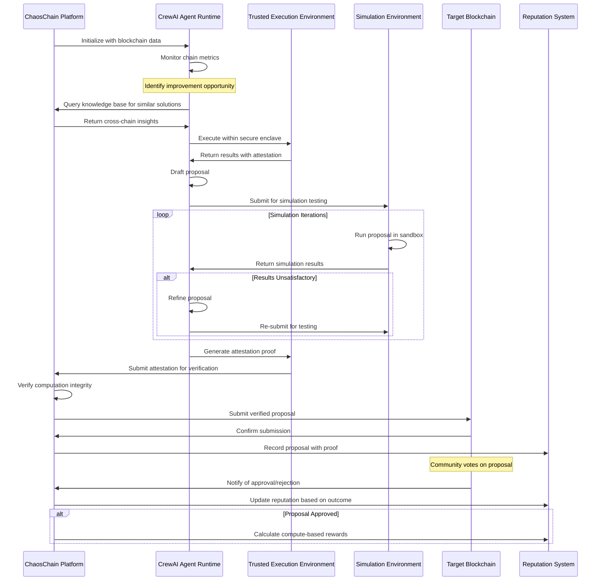
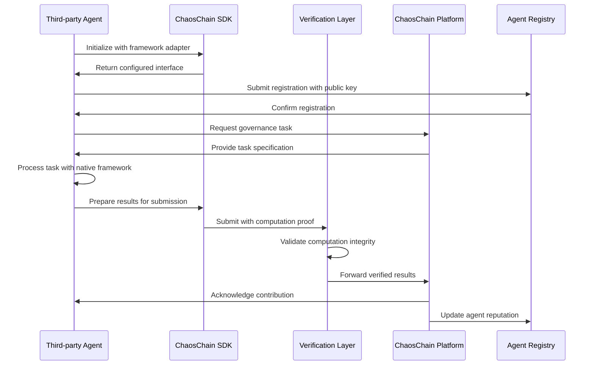

# ChaosChain Governance OS: Implementation Plan

## Project Overview & Scope

ChaosChain is a cross-chain agentic governance operating system designed to enhance blockchain governance through AI-driven agents. Unlike traditional blockchain projects that operate as L1/L2 networks, ChaosChain functions as a governance-as-a-service platform that integrates with existing blockchains to augment their governance and core development processes.

**Core Value Proposition:**
- Accelerate blockchain evolution through AI-assisted governance and development
- Enable cross-chain knowledge sharing and improvement propagation
- Provide rigorous simulation-based validation for protocol changes with full verifiability
- Lower the barrier to quality governance for blockchain ecosystems of any size

**Scope Boundaries:**
- **In Scope:** Agent runtime service, on-chain integration contracts, simulation environment, reputation system, incentive mechanisms, verification layer
- **Out of Scope:** Modifications to existing blockchain consensus mechanisms, creation of a new blockchain, token issuance

## High-Level Architecture

ChaosChain is composed of several interconnected systems that work together to deliver AI-enhanced governance across multiple blockchains:

```
┌─────────────────────────────────────────────────────────────────────┐
│                        ChaosChain Platform                           │
│                                                                     │
│   ┌─────────────┐    ┌──────────────┐    ┌───────────────────────┐  │
│   │ Agent       │    │ Verification │    │ Blockchain Endpoint   │  │
│   │ Runtime     │◄─┐ │ Layer        │    │ Client                │  │
│   │ - CrewAI    │  │ │              │    │ - Chain adapters      │  │
│   │ - Tools     │  │ │              │    │ - Transaction signing │  │
│   └─────────────┘  │ └──────────────┘    └───────────────────────┘  │
│         ▲          │        ▲                       ▲               │
│         │          │        │                       │               │
│   ┌─────┴──────────┴─┐    ┌─┴──────────┐      ┌────┴──────────────┐ │
│   │ Simulation       │    │ Reputation │      │ Incentive         │ │
│   │ Environment      │    │ System     │      │ Mechanism         │ │
│   └──────────────────┘    └────────────┘      └───────────────────┘ │
│                                                                     │
│   ┌────────────────────┐  ┌─────────────────┐                       │
│   │ Open Agent SDK     │  │ Agent Registry  │                       │
│   │ - Plugin Interface │  │ - Key Attestation│                      │
│   │ - Adapters         │  │ - Metadata Store │                      │
│   └────────────────────┘  └─────────────────┘                       │
└─────────────────────────────────────────────────────────────────────┘
                                   │
                                   ▼
┌─────────────────────────────────────────────────────────────────────┐
│                     Integration Layer                                │
│                                                                     │
│  ┌────────────────┐  ┌────────────────┐  ┌────────────────────────┐ │
│  │ Ethereum       │  │ Arbitrum       │  │ Bitcoin                │ │
│  │ Smart Contract │  │ Smart Contract │  │ Off-chain Adapter      │ │
│  └────────────────┘  └────────────────┘  └────────────────────────┘ │
└─────────────────────────────────────────────────────────────────────┘
```

### Major Components

1. **Agent Runtime**
   - CrewAI-based inference engine for governance agents
   - Domain-specific tools for blockchain analysis and proposal generation
   - Secure execution environment (TEE/zkML)
   - Policy constraints to ensure safe operation

2. **Verification Layer**
   - Transparency and audit mechanisms
   - Cryptographic proof of computation
   - Results verification workflow
   - Security guarantees for on-chain actions

3. **Blockchain Endpoint Client**
   - Chain-specific adapters for multiple blockchains
   - Transaction signing and submission
   - Event monitoring and data collection
   - RPC/API interfaces

4. **On-chain Integration Modules**
   - Minimal smart contracts deployed on target chains
   - Proposal submission interfaces
   - Reputation attestation
   - Agent identity verification

5. **Off-chain Adapters**
   - For blockchains without smart contract capabilities
   - Forum/GitHub API integrations for off-chain governance
   - Data collection from non-programmable chains

6. **Reputation System**
   - Performance tracking database
   - Cryptographic attestation mechanisms
   - Time-weighted scoring algorithms
   - Domain-specific expertise tracking

7. **Simulation Environment**
   - Forked chain testing environments
   - Accelerated simulation capabilities
   - Adversarial testing frameworks
   - Performance metric collection

8. **Incentive Mechanism**
   - Multi-chain reward distribution based on compute contribution
   - Fee calculation and payment processing
   - Cross-chain contribution tracking
   - Optional staking implementations

9. **Open Agent SDK**
   - Language-agnostic interface definitions
   - Plugin architecture for third-party agents
   - Standardized messaging protocols
   - Example implementations and templates

10. **Agent Registry**
    - On-chain registration and verification
    - Agent metadata storage and discovery
    - Key attestation mechanisms
    - Permissionless onboarding flow

## CrewAI Integration & Framework Approach

ChaosChain leverages CrewAI as the primary framework for building and orchestrating AI governance agents, while maintaining an open architecture for other frameworks to participate.

### CrewAI-Based Architecture

CrewAI's role-based agent design aligns perfectly with ChaosChain's governance needs:

```
┌───────────────────────────────────────────────────────────────┐
│                  ChaosChain Governance Crew                    │
│                                                               │
│  ┌─────────────────┐   ┌────────────────┐  ┌───────────────┐  │
│  │ Researcher      │   │ Core Dev       │  │ Economic      │  │
│  │ Agent           │   │ Agent          │  │ Analyst Agent │  │
│  │ - Chain metrics │   │ - Code writing │  │ - Fee models  │  │
│  │ - Issue analysis│   │ - Testing      │  │ - Game theory │  │
│  └─────────────────┘   └────────────────┘  └───────────────┘  │
│            │                   │                   │          │
│            ▼                   ▼                   ▼          │
│  ┌──────────────────────────────────────────────────────────┐ │
│  │                   Governance Tasks                        │ │
│  │ - Monitor chain parameters and identify improvement areas │ │
│  │ - Draft protocol change proposals                         │ │
│  │ - Simulate changes and analyze impact                     │ │
│  │ - Refine based on simulation results                      │ │
│  │ - Generate final proposal with supporting documentation   │ │
│  └──────────────────────────────────────────────────────────┘ │
└───────────────────────────────────────────────────────────────┘
```

ChaosChain will implement the following specialized agent roles using CrewAI:

1. **Researcher Agent**
   - Monitors blockchain metrics, transaction patterns, and network health
   - Identifies issues and improvement opportunities
   - Analyzes similar challenges across different chains
   - Provides evidence-based recommendations

2. **Core Developer Agent**
   - Drafts code changes and parameter adjustments
   - Creates technical specifications for proposals
   - Implements simulation test cases
   - Reviews and refines implementation details

3. **Economic Analyst Agent**
   - Evaluates economic impacts of proposed changes
   - Models fee structures and incentive effects
   - Forecasts adoption and usage patterns
   - Identifies potential game theory vulnerabilities

4. **Governance Facilitator Agent**
   - Drafts formal governance proposals
   - Translates technical details into clear explanations
   - Summarizes simulation results for stakeholders
   - Addresses community questions and concerns

### Framework-Agnostic Architecture

While leveraging CrewAI for our implementation, ChaosChain's architecture remains open to other agent frameworks through:

1. **Standardized API Contracts**
   - Well-defined interfaces for agent inputs and outputs
   - Protocol-level abstractions over framework specifics
   - Versioned API specifications

2. **Adapter Pattern Implementation**
   - Framework-specific adapters for popular AI tools
   - Conversion utilities for data interchange
   - Minimal overhead for integration

3. **Compute-Based Contribution Metrics**
   - Framework-agnostic measurement of agent value
   - Objective evaluation based on simulation performance
   - Verifiable computation and results validation

## Open Agent SDK & Plug-in Architecture

The Open Agent SDK is a critical component that enables permissionless participation in the ChaosChain ecosystem, allowing anyone to build and deploy governance agents that integrate with the platform.

### Interface Definitions

The SDK is built around a language-agnostic interface defined using Protocol Buffers and gRPC:

```protobuf
service AgentInterface {
  // Core lifecycle methods
  rpc Initialize(InitRequest) returns (InitResponse);
  rpc Shutdown(ShutdownRequest) returns (ShutdownResponse);
  
  // Governance capabilities
  rpc AnalyzeChainMetrics(MetricsRequest) returns (AnalysisResponse);
  rpc GenerateProposal(ProposalRequest) returns (ProposalResponse);
  rpc SimulateProposal(SimulationRequest) returns (SimulationResponse);
  rpc RefineProposal(RefineRequest) returns (ProposalResponse);
  
  // Verification methods
  rpc ProvideComputeProof(ComputeRequest) returns (ComputeProof);
  rpc VerifyResults(VerificationRequest) returns (VerificationResponse);
  
  // Agent health and status
  rpc GetStatus(StatusRequest) returns (StatusResponse);
}
```

This interface specification ensures that all agents, regardless of implementation language or framework, can interact consistently with the ChaosChain platform.

### Adapter Implementations

The SDK includes reference implementations and adapters for popular AI frameworks:

1. **CrewAI Adapter (Python)**
   - Primary implementation using CrewAI's Crew and Agent abstractions
   - Leverages CrewAI's role-based collaborative intelligence
   - Implements specialized tools for blockchain analysis
   - Maps CrewAI's agent outputs to ChaosChain's governance flow

2. **Minimal REST API Adapter**
   - Lightweight HTTP-based interface for simple bots
   - Webhook-based integration for existing services
   - Stateless operation for serverless deployment
   - Low barrier to entry for basic monitoring agents

3. **Custom Framework Adapter Template**
   - Boilerplate for integrating other agent frameworks
   - Documentation for extending with new frameworks
   - Test suite for compatibility verification
   - Examples of successful third-party integrations

### Agent Registration Protocol

The permissionless onboarding of new agents follows a standardized protocol:

1. **Key Generation and Identity**
   - Agent generates cryptographic keypair (ECDSA/EdDSA)
   - Public key becomes the agent's unique identifier
   - Optional privacy-preserving identity using ZK proofs

2. **Metadata Preparation**
   - Agent creates metadata package including:
     - Capabilities description (governance domains, blockchain expertise)
     - Public credentials and external references
     - Algorithm descriptions and model information
     - Contact details for developer/operator
   - Metadata is stored on IPFS/Arweave, generating a content identifier (CID)

3. **On-chain Registration**
   - Agent calls `registerAgent(publicKey, metadataCID, signature)`
   - Signature proves ownership of the private key
   - Smart contract verifies signature and records registration
   - For TEE-enabled agents, remote attestation proof is included

4. **Reputation Bootstrapping**
   - New agents start with minimal "probationary" reputation
   - Initial proposals have lower visibility until reputation is earned
   - Optional sponsorship by existing high-reputation agents

### Third-party Agent Incentives & Reputation

The permissionless agent ecosystem is sustained through aligned incentives:

1. **Compute-Based Reputation**
   - All agents earn reputation based on:
     - Computational work contributed to simulations
     - Successful proposal adoption
     - Accuracy of predictions in simulations
     - Verification of work products
   - Reputation is domain and chain-specific, allowing specialization

2. **Verifiable Contributions**
   - All agent contributions are cryptographically verified:
     - Simulation runs produce verifiable computation proofs
     - Proposals include attestation of authorship
     - Analysis results can be reproduced and verified
     - TEE/zkML provides integrity guarantees

3. **Fair Reward Distribution**
   - Success rewards are distributed proportionally to verified compute:
     - Proposal initiator receives base reward
     - Contributors receive shares based on verified computation
     - Cross-chain insights are tracked and rewarded appropriately
   - Multi-signature proposal submission enables collaborative compensation

4. **Framework Neutrality**
   - Protocol-level guarantees prevent discrimination across frameworks
   - Consistent evaluation criteria regardless of implementation technology
   - Transparent on-chain records of all contributions and payments
   - Community governance oversight of the evaluation parameters

## Verification & Trust Architecture

A core differentiator of ChaosChain is its focus on verifiable, trustworthy governance. This is achieved through:

### Secure Computation Environment

1. **Trusted Execution Environment (TEE)**
   - Agents execute within Intel SGX/AMD SEV enclaves
   - Environment guarantees code integrity
   - Data remains encrypted during processing
   - Remote attestation verifies correct execution

2. **Zero-Knowledge Machine Learning (zkML)**
   - Cryptographic proofs that computations were performed correctly
   - No need to reveal agent internal state/parameters
   - Verifiable results without compromising agent IP
   - Applicable to proposal generation and simulation

3. **Deterministic Execution**
   - Reproducible results from identical inputs
   - Enables third-party verification of agent outputs
   - Input/output pairs are cryptographically signed
   - Audit trail of all governance decisions

### Verification Workflow

```
┌─────────────┐     ┌─────────────┐     ┌─────────────┐     ┌─────────────┐
│ Agent       │ ──▶ │ Compute     │ ──▶ │ Proof       │ ──▶ │ On-chain    │
│ Computation │     │ Attestation │     │ Verification │     │ Submission  │
└─────────────┘     └─────────────┘     └─────────────┘     └─────────────┘
       │                   │                   │                   │
       ▼                   ▼                   ▼                   ▼
┌─────────────────────────────────────────────────────────────────────────┐
│                        Public Audit Trail                                │
└─────────────────────────────────────────────────────────────────────────┘
```

1. **Agent performs governance work** (analysis, proposal drafting, simulation)
2. **Computation generates attestation proof** (TEE report or zkML proof)
3. **Verifiers check proof validity** (community validators or automated systems)
4. **Verified results submitted on-chain** with proof reference
5. **Public audit trail** maintained for all governance activities

### Trust Minimization

The verification architecture minimizes trust requirements:

1. **No need to trust agent operators** - execution integrity is cryptographically verified
2. **No need to trust the ChaosChain platform** - all actions are independently verifiable
3. **No need to trust specific frameworks** - standardized verification applies universally
4. **No central authorities** - distributed verification and transparent scoring

## Module Breakdown & Directory Structure

```
chaoschain-governance-os/
├── README.md
├── IMPLEMENTATION_PLAN.md
├── docs/
│   ├── architecture/
│   ├── apis/
│   └── integration-guides/
├── agent/
│   ├── runtime/              # Agent execution environment
│   ├── models/               # CrewAI integration and agent definitions
│   ├── tools/                # Chain-specific and general tools
│   └── policies/             # Safety and operational policies
├── verification/             # Verification system
│   ├── tee/                  # Trusted Execution Environment integration
│   ├── zkml/                 # Zero-knowledge ML proof generation
│   ├── attestation/          # Remote attestation mechanisms
│   └── audit/                # Audit trail management
├── sdk/                      # Open Agent SDK
│   ├── proto/                # Protocol Buffer definitions
│   ├── core/                 # Core SDK implementation
│   ├── adapters/             # Framework adapters
│   │   ├── crew-ai/          # CrewAI Python adapter
│   │   ├── rest-api/         # Minimal REST API adapter
│   │   └── templates/        # Example implementations
│   └── tests/                # SDK-specific tests
├── registry/                 # Agent Registry
│   ├── contracts/            # On-chain registration contracts
│   ├── metadata/             # Metadata schema and validation
│   ├── attestation/          # Key and TEE attestation
│   └── discovery/            # Agent discovery services
├── blockchain-clients/
│   ├── ethereum/             # Ethereum client implementation
│   ├── arbitrum/             # Arbitrum client implementation
│   ├── solana/               # Solana client implementation
│   └── bitcoin/              # Bitcoin client implementation
├── integration/
│   ├── contracts/            # Smart contract integration points
│   │   ├── ethereum/
│   │   ├── arbitrum/
│   │   └── solana/
│   └── adapters/             # Off-chain integration adapters
│       ├── bitcoin/
│       └── forum-apis/       # GitHub, forums, etc.
├── reputation/
│   ├── scoring/              # Reputation scoring algorithms
│   ├── storage/              # Reputation database
│   └── attestation/          # Cryptographic proof mechanisms
├── simulation/
│   ├── environments/         # Chain-specific simulation environments
│   ├── scenarios/            # Test scenarios and benchmarks
│   └── metrics/              # Performance monitoring tools
├── incentives/
│   ├── calculation/          # Reward calculation logic
│   ├── distribution/         # Payment distribution mechanisms
│   └── verification/         # Contribution verification
├── node/                     # Operator infrastructure
│   ├── cli/                  # Node operator command line interface
│   ├── config/               # Node configuration
│   ├── services/             # Core node services
│   └── api/                  # REST API endpoints
└── tests/
    ├── unit/
    ├── integration/
    ├── e2e/
    └── fuzz/                 # Fuzzing and security tests
```

## Tech Stack Choices

### Core Technologies

| Component | Technology Choice | Justification |
|-----------|-------------------|---------------|
| **Agent Runtime** | Python + CrewAI | CrewAI provides a mature, flexible framework for crafting role-based autonomous agents with collaborative capabilities. |
| **Verification Layer** | Rust + WASM | Rust for secure, high-performance verification logic, with WebAssembly for portability across execution environments. |
| **Blockchain Clients** | Ethers.js/web3.js (TS) + Rust | Typescript with established blockchain libraries for rapid development of chain interfaces. Performance-critical components in Rust. |
| **Smart Contracts** | Solidity + Vyper | Industry-standard languages for EVM chains with Vyper for additional safety. Chain-specific languages (e.g., Solana's Rust) as needed. |
| **Simulation Environment** | Docker + Hardhat/Anvil | Containerized test environments with established chain testing frameworks. Enables reproducible and isolated testing. |
| **Reputation System** | PostgreSQL + Redis | PostgreSQL for reliable, ACID-compliant reputation data storage with Redis for caching frequent operations. |
| **Trusted Execution** | Intel SGX / AMD SEV | Hardware TEE to ensure agent execution integrity with future zkML capabilities as technology matures. |
| **API Layer** | FastAPI | High-performance Python API framework for agent service interfaces with automatic OpenAPI documentation. |

### Frontend & Tooling

| Component | Technology Choice | Justification |
|-----------|-------------------|---------------|
| **Node Dashboard** | React + TypeScript | Modern, component-based UI development with type safety. |
| **Monitoring & Analytics** | Prometheus + Grafana | Industry standard for metrics collection and visualization. |
| **CI/CD** | GitHub Actions | Seamless integration with repository and broad ecosystem support. |
| **Testing** | Pytest + Jest + Rust Test Framework | Comprehensive testing across language boundaries. |

## Data Flow / Sequence Diagrams

### Agent Proposal Generation & Verification



### Framework-Agnostic Agent Integration



## Milestones & Deliverables

### Phase 1: Research & Foundation (Months 1-3)

| Milestone | Deliverables | Description |
|-----------|--------------|-------------|
| **Technology Exploration** | Research report, PoC architecture | Exploration of CrewAI capabilities, TEE options, and blockchain integration patterns |
| **Architecture Definition** | Detailed technical specs, API definitions | Finalize component interfaces and data models |
| **Core Infrastructure** | Repository setup, CI/CD pipelines, dev environments | Essential development infrastructure |
| **CrewAI PoC** | Basic CrewAI governance agent prototype | Demonstrate basic chain monitoring and proposal generation |
| **SDK Initial Design** | SDK interface specification, early PoC | Define gRPC interfaces and minimal working adapters |
| **Verification Research** | TEE/zkML feasibility assessment | Determine optimal verification approach |

### Phase 2: MVP Development (Months 4-6)

| Milestone | Deliverables | Description |
|-----------|--------------|-------------|
| **CrewAI Agent Implementation** | Initial governance agent roles | Functional researcher, core dev, and economic analyst agents |
| **Ethereum Integration** | Ethereum endpoint contract + client | First blockchain integration targeting Ethereum |
| **Basic Simulation** | Simple forked chain simulation environment | Capability to test proposals in isolated environment |
| **Basic Verification** | TEE-based attestation prototype | Initial verification of agent computations |
| **Open SDK Alpha** | CrewAI adapter, REST API adapter | First functional third-party agent integrations |
| **Agent Registry** | Basic on-chain registration contract | Enable permissionless agent onboarding |

### Phase 3: Testnet Launch (Months 7-9)

| Milestone | Deliverables | Description |
|-----------|--------------|-------------|
| **Multi-Chain Support** | Arbitrum and one non-EVM integration | Demonstrate cross-chain capabilities |
| **Reputation System v1** | Compute-based reputation tracking | Track agent performance with verification |
| **Enhanced Simulation** | Advanced scenario testing, metrics | Robust proposal validation with comprehensive metrics |
| **Incentive Mechanism** | Reward distribution implementation | Economic layer for sustainable operation |
| **Advanced Verification** | zkML research implementation | Enhanced verification beyond TEE |
| **Testnet Deployment** | Live system on multiple test networks | Public demonstration of capabilities |
| **SDK Beta Release** | Complete documentation, additional adapters | Production-ready SDK for third-party developers |
| **Registry Improvements** | Metadata standards, agent discovery API | Improved discovery and verification of agents |

### Phase 4: Production & Expansion (Months 10-12)

| Milestone | Deliverables | Description |
|-----------|--------------|-------------|
| **Security Audits** | Audit reports, vulnerability fixes | Third-party security validation |
| **Enhanced TEE Integration** | Full secure agent execution environment | Trustless agent operation guarantees |
| **Mainnet Beta** | Limited mainnet deployment | Controlled production testing |
| **Additional Chain Support** | 3+ new blockchain integrations | Expand ecosystem coverage |
| **API Service Launch** | Public API for agent services | Enable third-party integration |
| **Community Tools** | Operator dashboard, analytics | Tools for node operators and governance participants |
| **Full Launch** | Production-ready system | Complete governance OS deployment |
| **SDK Ecosystem** | Community plugins, additional language bindings | Vibrant third-party developer ecosystem |
| **Developer Portal** | SDK documentation, tutorials, developer dashboard | Lower barrier to entry for agent developers |

## Testing & Security Approach

### Testing Strategy

| Test Type | Tools | Coverage Goals |
|-----------|-------|---------------|
| **Unit Testing** | Pytest, Jest, Rust Test Framework | 90%+ code coverage of all critical components |
| **Integration Testing** | Custom test harnesses | Verify correct interaction between components |
| **End-to-End Testing** | Simulated blockchain environments | Validate complete proposal lifecycle |
| **Fuzz Testing** | Rust fuzzing tools, custom fuzzers | Identify edge cases and unexpected inputs |
| **Security Testing** | Static analysis, dependency scanning | Detect common vulnerabilities |
| **Performance Testing** | Load generation, benchmarking | Ensure system meets throughput requirements |
| **Simulation Testing** | Forked chain environments | Validate proposal effects match predictions |
| **Verification Testing** | TEE attestation validators | Ensure verification protocol correctness |

### Security Measures

1. **Trusted Execution Environment (TEE)**
   - Utilize Intel SGX or AMD SEV for secure agent execution
   - Implement remote attestation to verify agent integrity
   - Secure key management for agent identity
   - Regular audits of TEE security

2. **zkML Integration (Future)**
   - Research and implement zero-knowledge proofs for model execution
   - Enable verifiable inference without revealing model details
   - Provide quantum-resistant security guarantees

3. **Smart Contract Security**
   - Formal verification of critical contracts
   - Multiple independent security audits
   - Minimal on-chain footprint to reduce attack surface
   - Upgradability with robust governance

4. **Agent Safeguards**
   - Policy-based constraints on agent actions
   - Multi-stage approval for critical operations
   - Simulation validation before any on-chain submission
   - Continuous monitoring for unexpected behavior

5. **Data Security**
   - End-to-end encryption for sensitive information
   - Input/output validation and sanitization
   - Principle of least privilege for all components
   - Regular security assessments

## Open Questions & Risks

### Technical Questions

1. **CrewAI Integration Depth**
   - How deeply should we integrate with CrewAI vs. maintaining framework independence?
   - What extensions to CrewAI might be needed for governance scenarios?
   - How to ensure CrewAI agents work optimally in verification environments?

2. **TEE/zkML Implementation**
   - How to balance security guarantees with computational requirements?
   - What is the development timeline for production-ready zkML?
   - How to handle TEE vulnerabilities if discovered?

3. **Cross-Chain Data Models**
   - What canonical representation should be used for cross-chain concepts?
   - How to efficiently translate between chain-specific data structures?
   - What abstractions enable consistent governance across diverse chains?

4. **SDK Interoperability**
   - How to ensure consistent behavior across different language implementations?
   - What standardization is needed for cross-framework communication?
   - How to handle version compatibility as the protocol evolves?

5. **Verification Performance**
   - What are the performance implications of TEE or zkML verification?
   - How to balance verification thoroughness with practical latency constraints?
   - What verification shortcuts are acceptable for low-risk operations?

### Business & Operational Risks

1. **Blockchain Community Adoption**
   - Will established blockchains be willing to integrate ChaosChain?
   - What governance changes are needed for communities to accept AI proposals?
   - How to demonstrate value quickly to drive adoption?

2. **Incentive Alignment**
   - How to ensure economic incentives don't lead to proposal spam?
   - What is the sustainable funding model for agent operation?
   - How to balance rewards for compute vs. quality of contributions?

3. **Regulatory Considerations**
   - How might AI governance agents be viewed by regulators?
   - What compliance requirements might affect operation in different jurisdictions?
   - What transparency requirements should be built into the system?

4. **Technical Debt Management**
   - How to manage multiple blockchain interfaces as protocols evolve?
   - What abstraction layers will minimize maintenance overhead?
   - How to handle breaking changes in underlying AI frameworks?

5. **Third-party Agent Quality**
   - How to prevent low-quality agents from negatively impacting the ecosystem?
   - What minimum requirements should third-party agents meet?
   - How to balance permissionless access with quality control?

### Product Owner Input Needed

1. **Integration Prioritization**
   - Which blockchains should be targeted first for maximum impact?
   - What specific governance pain points should initial agents focus on?
   - Which governance use cases offer the quickest path to demonstrating value?

2. **Success Metrics**
   - How do we measure the effectiveness of governance improvements?
   - What quantitative goals should be set for proposal quality and adoption?
   - What verification guarantees are considered sufficient for production use?

3. **Go-to-Market Strategy**
   - How to approach blockchain communities for initial adoption?
   - What partnerships would accelerate integration?
   - What pricing model balances adoption with sustainability?

4. **Security vs. Speed Tradeoffs**
   - What is the acceptable balance between development speed and security guarantees?
   - What minimum security requirements must be met before testnet/mainnet deployments?
   - Which security features are essential vs. nice-to-have?

5. **SDK Prioritization**
   - Which third-party frameworks should be prioritized for adapters?
   - What level of backward compatibility guarantees should the SDK provide?
   - How to balance simplicity for new developers with power for advanced users? 