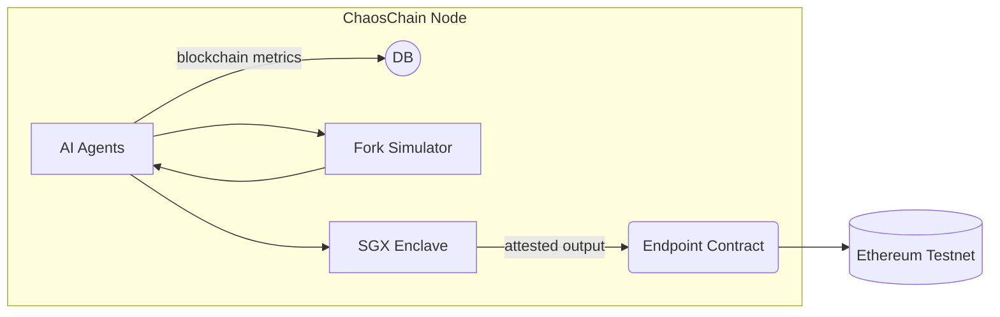

# ChaosChain Governance OS

[](https://opensource.org/licenses/MIT)
[](https://www.python.org/downloads/)
[](https://nodejs.org/)
[](https://soliditylang.org/)

<p align="center">
  
</p>

<p align="center">
  <b>A cross-chain, AI-driven governance platform for blockchain networks</b>
</p>

---

## 🔍 What is ChaosChain?

ChaosChain is a cross-chain agentic governance operating system designed to enhance blockchain governance through AI-driven agents. ChaosChain functions as a governance-as-a-service platform that integrates with existing blockchains to augment their governance and core development processes.

### Core Value Proposition

- **Accelerate blockchain evolution** through AI-assisted governance and development
- **Enable cross-chain knowledge sharing** and improvement propagation
- **Provide rigorous simulation-based validation** for protocol changes with full verifiability
- **Cryptographic verification:** agents run inside SGX (zkML coming) — anyone can audit the attestation
- **Drop‑in for existing DAOs/L1s:** minimal endpoint contract or off‑chain adapter, no consensus changes
- **Lower the barrier** to quality governance for blockchain ecosystems of any size



## Architecture

ChaosChain consists of several interconnected systems that work together to deliver AI-enhanced governance:

```
┌─────────────────────────────────────────────────────────────────────┐
│                        ChaosChain Platform                           │
│                                                                     │
│   ┌─────────────┐    ┌──────────────┐    ┌───────────────────────┐  │
│   │ Agent       │    │ Verification │    │ Blockchain Endpoint   │  │
│   │ Runtime     │◄─┐ │ Layer        │    │ Client                │  │
│   │ - Framework │  │ │              │    │ - Chain adapters      │  │
│   │   Agnostic  │  │ │              │    │ - Transaction signing │  │
│   └─────────────┘  │ └──────────────┘    └───────────────────────┘  │
│         ▲          │        ▲                       ▲               │
│         │          │        │                       │               │
│   ┌─────┴──────────┴─┐    ┌─┴──────────┐      ┌────┴──────────────┐ │
│   │ Simulation       │    │ Reputation │      │ Incentive         │ │
│   │ Environment      │    │ System     │      │ Mechanism         │ │
│   └──────────────────┘    └────────────┘      └───────────────────┘ │
└─────────────────────────────────────────────────────────────────────┘
```

### Major Components

1. **Agent Runtime**: Framework-agnostic inference engine for governance agents
2. **Verification Layer**: Transparency and audit mechanisms with TEE (Trusted Execution Environment)
3. **Blockchain Endpoint Client**: Chain-specific adapters for multiple blockchains
4. **Simulation Environment**: Forked chain testing environments for proposal validation
5. **Reputation System**: Performance tracking for agent contributions

For detailed architecture documentation, see the [Implementation Plan](IMPLEMENTATION_PLAN.md) and [MVP Specification](docs/MVP_SPEC.md).

## Getting Started

### Prerequisites

- Python 3.10+
- Node.js 18+
- Rust toolchain (stable)
- [Optional] Intel SGX SDK for TEE development

### Installation

1. **Clone the repository**:
   ```bash
   git clone https://github.com/YOUR_ORG/chaoschain-governance-os.git
   cd chaoschain-governance-os
   ```

2. **Create virtual environment** (recommended):
   ```bash
   python -m venv chaos
   source chaos/bin/activate  # On Windows: chaos\Scripts\activate
   ```

3. **Install Python dependencies**:
   ```bash
   pip install -e ".[dev]"
   ```

4. **Install Node.js dependencies**:
   ```bash
   npm install
   ```

5. **Configure environment**:
   ```bash
   cp env.example .env
   # Edit .env with your configuration (API keys, RPC endpoints, etc.)
   ```

### Running Tests

```bash
# Python tests
pytest

# Individual Python test file
pytest tests/unit/agent/test_quick_demo.py -v

# Node.js/Ethereum tests
npx hardhat test

# Compile contracts
npx hardhat compile
```

### Running the Agent

```bash
# Basic demo
python agent/runtime/demo.py --rpc https://sepolia.infura.io/v3/YOUR_INFURA_KEY
```


## 📚 Documentation

- [Implementation Plan](IMPLEMENTATION_PLAN.md): Comprehensive project overview and roadmap
- [MVP Specification](docs/MVP_SPEC.md): Minimum Viable Product details
- Architecture documents: Found in the [docs/architecture](docs/architecture) directory

## Contributing

We welcome contributions from the community! To contribute:

1. Fork the repository
2. Create a feature branch (`git checkout -b feature/amazing-feature`)
3. Commit your changes (`git commit -m 'Add some amazing feature'`)
4. Push to the branch (`git push origin feature/amazing-feature`)
5. Open a Pull Request

Please ensure your code follows our style guidelines and includes appropriate tests.

## 📄 License

This project is licensed under the MIT License - see the [LICENSE](LICENSE) file for details.

