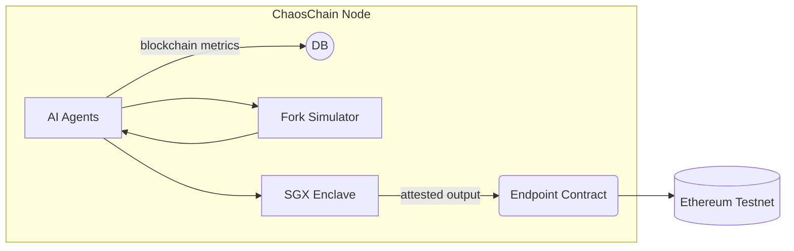

# ChaosChain Governance OS

[](https://opensource.org/licenses/MIT)
[](https://www.python.org/downloads/)
[](https://nodejs.org/)
[](https://soliditylang.org/)

<p align="center">
  
</p>

<p align="center">
  <b>A cross-chain, AI-driven governance platform for blockchain networks</b>
</p>

---

## 🔍 What is ChaosChain?

ChaosChain is a cross-chain agentic governance operating system designed to enhance blockchain governance through AI-driven agents. ChaosChain functions as a governance-as-a-service platform that integrates with existing blockchains to augment their governance and core development processes.

### Core Value Proposition

- **Accelerate blockchain evolution** through AI-assisted governance and development
- **Enable cross-chain knowledge sharing** and improvement propagation
- **Provide rigorous simulation-based validation** for protocol changes with full verifiability
- **Cryptographic verification:** agents run inside SGX (zkML coming) — anyone can audit the attestation
- **Drop‑in for existing DAOs/L1s:** minimal endpoint contract or off‑chain adapter, no consensus changes
- **Lower the barrier** to quality governance for blockchain ecosystems of any size



## Project Overview

The ChaosChain Governance OS provides the following core capabilities:

- **Cross-Chain Monitoring**: Monitor on-chain activity across various EVM-compatible chains
- **AI-Powered Analysis**: Analyze blockchain data to identify potential governance improvements
- **Governance Automation**: Generate and validate governance proposals using LLM-driven agents
- **Multi-Chain Execution**: Submit validated proposals to different blockchains

## Architecture

ChaosChain consists of several interconnected systems that work together to deliver AI-enhanced governance:

```
┌─────────────────────────────────────────────────────────────────────┐
│                        ChaosChain Platform                           │
│                                                                     │
│   ┌─────────────┐    ┌──────────────┐    ┌───────────────────────┐  │
│   │ Agent       │    │ Verification │    │ Blockchain Endpoint   │  │
│   │ Runtime     │◄─┐ │ Layer        │    │ Client                │  │
│   │ - Framework │  │ │              │    │ - Chain adapters      │  │
│   │   Agnostic  │  │ │              │    │ - Transaction signing │  │
│   └─────────────┘  │ └──────────────┘    └───────────────────────┘  │
│         ▲          │        ▲                       ▲               │
│         │          │        │                       │               │
│   ┌─────┴──────────┴─┐    ┌─┴──────────┐      ┌────┴──────────────┐ │
│   │ Simulation       │    │ Reputation │      │ Incentive         │ │
│   │ Environment      │    │ System     │      │ Mechanism         │ │
│   └──────────────────┘    └────────────┘      └───────────────────┘ │
└─────────────────────────────────────────────────────────────────────┘
```

### Major Components

1. **Agent Runtime**: Framework-agnostic inference engine for governance agents
2. **Verification Layer**: Transparency and audit mechanisms with TEE (Trusted Execution Environment)
3. **Blockchain Endpoint Client**: Chain-specific adapters for multiple blockchains
4. **Simulation Environment**: Forked chain testing environments for proposal validation
5. **Reputation System**: Performance tracking for agent contributions

For detailed architecture documentation, see the [Implementation Plan](IMPLEMENTATION_PLAN.md) and [MVP Specification](docs/MVP_SPEC.md).

## Getting Started

### Prerequisites

- Python 3.12+
- Node.js 18+ and npm
- Access to an Ethereum RPC endpoint
- (Optional) GPU for AI model acceleration

### Installation

1. Clone the repository:
   ```bash
   git clone https://github.com/your-organization/chaoschain-governance-os.git
   cd chaoschain-governance-os
   ```

2. Set up Python environment:
   ```bash
   python -m venv chaos
   source chaos/bin/activate  # On Windows, use: chaos\Scripts\activate
   pip install -e .
   ```

3. Install Ethereum dependencies:
   ```bash
   npm install
   ```

4. Set up environment variables:
   ```bash
   export ETHEREUM_RPC_URL=your_ethereum_rpc_url
   export OPENAI_API_KEY=your_openai_api_key  # If using OpenAI models
   ```

### Running the Application

#### Demo

The simplest way to see the system in action is to run the demo script:

```bash
# Run with default settings
python demo.py

# Run with verbose output
python demo.py --verbose
```

The demo uses mock data to simulate blockchain analysis and governance proposal generation.

#### Agent Testing

```bash
# Run unit tests
pytest tests/unit/

# Run the quick demo
python -m agent.quick_demo
```

#### Smart Contract Testing

```bash
# Compile contracts
npx hardhat compile

# Run contract tests
npx hardhat test
```

## Project Structure

```
chaoschain-governance-os/
├── agent/                   # AI agent implementation
│   ├── governance_crew.py   # Main governance crew implementation
│   ├── tools/               # Agent tools for blockchain interaction
│   └── models/              # Data models
├── ethereum/                # Ethereum smart contracts
│   ├── contracts/           # Solidity contracts
│   └── test/                # Contract tests
├── api/                     # API service
├── tests/                   # Test suite
│   ├── unit/                # Unit tests
│   └── integration/         # Integration tests
├── demo.py                  # Demo script
└── docs/                    # Documentation
```

## Technology Stack

- **Agent Framework**: CrewAI + LangChain
- **Blockchain Interaction**: Web3.py, Hardhat
- **AI Models**: Compatible with OpenAI, Anthropic Claude, and other providers
- **Smart Contracts**: Solidity
- **API**: FastAPI

## Contributing

Contributions are welcome! Please check out our [contribution guidelines](CONTRIBUTING.md) for details.

## License

This project is licensed under the MIT License - see the [LICENSE](LICENSE) file for details.

## Acknowledgments

- [CrewAI](https://github.com/joaomdmoura/crewAI) - Agent collaboration framework
- [LangChain](https://github.com/hwchase17/langchain) - LLM framework
- [Web3.py](https://github.com/ethereum/web3.py) - Ethereum interface
- [Hardhat](https://github.com/nomiclabs/hardhat) - Ethereum development environment

## 📚 Documentation

- [Implementation Plan](IMPLEMENTATION_PLAN.md): Comprehensive project overview and roadmap
- [MVP Specification](docs/MVP_SPEC.md): Minimum Viable Product details
- Architecture documents: Found in the [docs/architecture](docs/architecture) directory

## Contributing

We welcome contributions from the community! To contribute:

1. Fork the repository
2. Create a feature branch (`git checkout -b feature/amazing-feature`)
3. Commit your changes (`git commit -m 'Add some amazing feature'`)
4. Push to the branch (`git push origin feature/amazing-feature`)
5. Open a Pull Request

Please ensure your code follows our style guidelines and includes appropriate tests.

## 📄 License

This project is licensed under the MIT License - see the [LICENSE](LICENSE) file for details.

