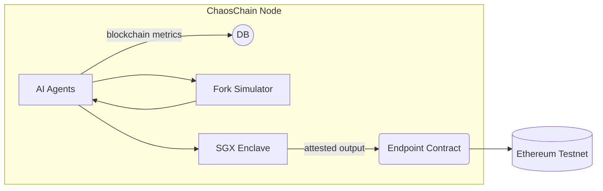

# ChaosChain Governance OS

[](https://opensource.org/licenses/MIT)
[](https://www.python.org/downloads/)
[](https://soliditylang.org/)

<p align="center">
  
</p>

<p align="center">
  <b>A cross-chain, AI-driven governance platform for blockchain networks</b>
</p>

---

## 🔍 What is ChaosChain?

ChaosChain is a cross-chain agentic governance operating system designed to enhance blockchain governance through AI-driven agents. ChaosChain functions as a governance-as-a-service platform that integrates with existing blockchains to augment their governance and core development processes.

### Core Value Proposition

- **Accelerate blockchain evolution** through AI-assisted governance and development
- **Enable cross-chain knowledge sharing** and improvement propagation
- **Provide rigorous simulation-based validation** for protocol changes with full verifiability
- **Cryptographic verification:** agents run inside secure execution environments with attestation
- **Drop‑in for existing DAOs/L1s:** minimal endpoint contract or off‑chain adapter integration
- **Lower the barrier** to quality governance for blockchain ecosystems of any size



## Project Overview

The ChaosChain Governance OS provides the following core capabilities:

- **Autonomous Governance Agents**: AI-powered agents that analyze blockchain data and execute governance tasks
- **On-Chain Data Analysis**: Real-time analysis of blockchain metrics and governance proposals
- **Transparent Decision Making**: Verifiable decision processes with Proof of Agency receipts
- **Secure Execution**: Execute governance tasks in secure, isolated environments
- **Multi-Chain Compatibility**: Support for different EVM-compatible blockchains

## Key Components

### Autonomous Governance Agent

The platform's cornerstone is the `GovernanceAnalystAgent`, which can:

1. Collect blockchain context data from multiple sources
2. Autonomously decide which governance tasks to execute
3. Securely execute tasks with verifiable outputs
4. Generate cryptographically verifiable Proof of Agency receipts
5. Anchor significant decisions to the blockchain

### Governance Tasks

The platform currently supports these governance tasks:

- **GasParameterOptimizer**: Analyzes gas usage patterns and recommends optimal parameters
- **ProposalSanityScanner**: Scans governance proposals for security issues and logical inconsistencies
- **MEVCostEstimator**: Estimates potential MEV extraction costs for proposed changes

### Blockchain Context Fetcher

The `GoerliContextFetcher` enables connection to real Ethereum networks to fetch:

- Recent blocks and their metrics
- Active governance proposals
- Gas price statistics and trends

## Getting Started

### Prerequisites

- Python 3.12+
- Web3.py and related dependencies
- Access to an Ethereum RPC endpoint (optional for real data, mock mode available)

### Installation

1. Clone the repository:
   ```bash
   git clone https://github.com/chaoschain/chaoschain-governance-os.git
   cd chaoschain-governance-os
   ```

2. Set up Python environment:
   ```bash
   python -m venv venv
   source venv/bin/activate  # On Windows, use: venv\Scripts\activate
   pip install -r requirements.txt
   ```

3. Set environment variables (optional for real blockchain data):
   ```bash
   export ETHEREUM_MOCK=false  # Set to true for mock data
   export ETHEREUM_PROVIDER_URL=your_ethereum_rpc_url
   ```

### Running the Governance Agent Demo

Run the autonomous governance agent demo:

```bash
# Run with agent decision-making
python examples/governance_agent_autonomous.py

# Specify a particular task
python examples/governance_agent_autonomous.py --task GasParameterOptimizer
python examples/governance_agent_autonomous.py --task ProposalSanityScanner
python examples/governance_agent_autonomous.py --task MEVCostEstimator

# Enable verbose output
python examples/governance_agent_autonomous.py --verbose
```

## Project Structure

```
chaoschain-governance-os/
├── agent/                            # Agent implementation
│   ├── agents/                       # Agent definitions
│   │   └── governance_analyst_agent.py  # Main agent implementation
│   ├── blockchain/                   # Blockchain interfaces
│   │   └── context_fetcher.py        # Context fetching from blockchains
│   ├── tasks/                        # Governance tasks
│   │   ├── gas_parameter_optimizer.py  # Gas parameter optimization
│   │   ├── mev_cost_estimator.py     # MEV cost estimation
│   │   └── proposal_sanity_scanner.py  # Proposal security scanning
│   ├── mock_*.py                     # Mock components for testing
│   └── task_registry.py              # Task registration system
├── examples/                         # Example scripts
│   └── governance_agent_autonomous.py  # Autonomous agent demo
├── tests/                            # Test suite
├── requirements.txt                  # Python dependencies
└── pyproject.toml                    # Project configuration
```

## Technology Stack

- **Agent Framework**: Compatible with CrewAI and LangChain
- **Blockchain Interaction**: Web3.py
- **AI Models**: Compatible with various LLM providers

## Recent Developments

### Sprint 7: Governance Agent Context Fetching

- Implemented `GoerliContextFetcher` for real blockchain data integration
- Enhanced task system to properly handle different data structures
- Improved agent decision making with fallbacks and error handling
- Added demonstration of autonomous governance operations

## Contributing

Contributions are welcome! To contribute:

1. Fork the repository
2. Create a feature branch (`git checkout -b feature/amazing-feature`)
3. Commit your changes (`git commit -m 'S#: Add some amazing feature'`) where # is the sprint number
4. Push to the branch (`git push origin feature/amazing-feature`)
5. Open a Pull Request

## License

This project is licensed under the MIT License - see the LICENSE file for details.

## 📚 Documentation

- [Implementation Plan](IMPLEMENTATION_PLAN.md): Comprehensive project overview and roadmap
- [MVP Specification](docs/MVP_SPEC.md): Minimum Viable Product details
- Architecture documents: Found in the [docs/architecture](docs/architecture) directory

## Overview

The ChaosChain Governance OS is a governance platform that combines AI agents, secure execution, and blockchain anchoring to create transparent, verifiable governance systems. This project is built on the ChaosCore platform.

## Components

- **Agent Registry**: Register and verify governance agents
- **Proof of Agency**: Log and verify agent actions
- **Secure Execution Environment**: Run code in a verifiable, isolated environment
- **Reputation System**: Track agent performance
- **Studio Framework**: Organize agents into governance crews

## Setup and Installation

### Prerequisites

- Python 3.10+
- Docker and Docker Compose
- Node.js 16+ (for Ethereum development)

### Local Development Setup

1. Clone the repository:
```bash
git clone https://github.com/chaoschain/chaoschain-governance-os.git
cd chaoschain-governance-os
```

2. Install dependencies:
```bash
pip install -e .
```

3. Run the demo:
```bash
python demo_governance_flow.py
```

### Staging Environment

The staging environment is a production-like environment used for testing. It includes:

- PostgreSQL for persistent storage
- SGX dev-container for secure execution
- Goerli testnet for blockchain anchoring
- Prometheus and Grafana for monitoring

#### Setting Up Staging

1. Start the staging environment:
```bash
docker-compose up -d
```

2. The following services will be available:
   - ChaosCore API: http://localhost:8000
   - PostgreSQL: localhost:5432
   - SGX Enclave: http://localhost:7000
   - Prometheus: http://localhost:9090
   - Grafana: http://localhost:3000 (username: admin, password: admin)

3. Environment variables for connecting to services:
```
# PostgreSQL
POSTGRES_USER=chaoscore
POSTGRES_PASSWORD=chaoscore_pass
POSTGRES_HOST=localhost
POSTGRES_PORT=5432
POSTGRES_DB=chaoscore

# SGX Enclave
SGX_ENCLAVE_URL=http://localhost:7000

# Ethereum (Goerli)
ETHEREUM_PROVIDER_URL=https://goerli.infura.io/v3/your-api-key
ETHEREUM_CONTRACT_ADDRESS=0x1234567890123456789012345678901234567890
```

4. Run the demo in staging mode:
```bash
python demo_governance_flow.py --stage
```

## Testing

### Run Tests
```bash
pytest tests/
```

### Run Linting
```bash
black .
isort .
flake8 .
```

## SDK

The ChaosCore SDK can be used to interact with the platform:

```python
from chaoscore.sdk.python import ChaosCoreClient

# Create a client
client = ChaosCoreClient()

# Register an agent
agent_id = client.register_agent(
    name="Parameter Optimizer",
    email="optimizer@example.com",
    metadata={"role": "developer"}
)

# Log an action
action_id = client.log_action(
    agent_id=agent_id,
    action_type="OPTIMIZE",
    description="Optimize gas parameters"
)
```

## Monitoring

The platform includes monitoring tools to track system metrics:

- **Prometheus**: Collects metrics at http://localhost:9090
- **Grafana**: Visualizes metrics at http://localhost:3000

The dashboard visualizes:
- Agent count
- Action count
- Simulation count
- Anchoring operations
- API performance

## Architecture

The ChaosChain Governance OS is built on the ChaosCore platform, which provides core infrastructure for governance operations:

1. Agents are registered in the Agent Registry
2. Agent actions are logged through Proof of Agency
3. Simulations run in the Secure Execution Environment
4. Results are anchored to Ethereum
5. Agent reputation is updated based on outcomes

