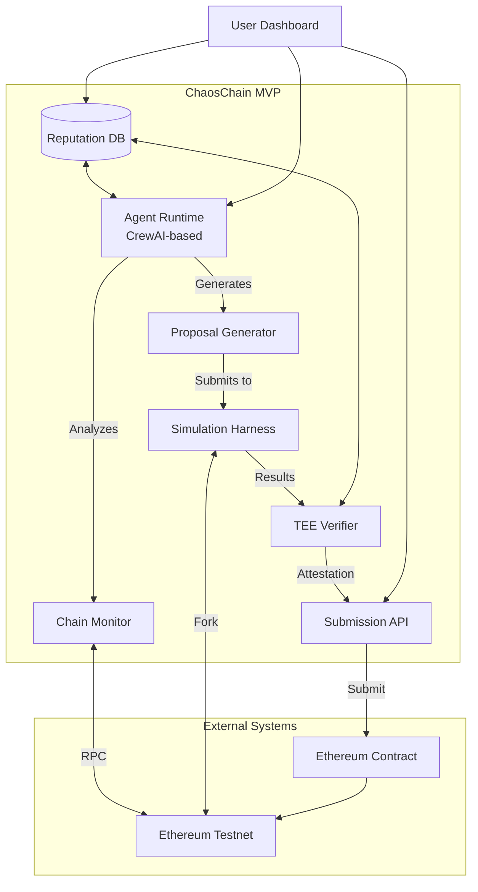

# ChaosChain Governance OS: MVP Specification

## Overview

This document defines the Minimum Viable Product (MVP) for ChaosChain Governance OS, a cross-chain, AI-driven governance platform for blockchain networks. The MVP focuses on demonstrating the core value proposition with minimal complexity while providing a foundation for future expansion.

## MVP Scope

### In Scope

- **Single Chain Support**: Ethereum testnet (Sepolia or Goerli) as the target chain
- **Parameter Tuning**: Focused on gas limit and fee market parameters
- **Basic Monitoring**: Collection and analysis of key blockchain metrics
- **Proposal Generation**: CrewAI-based agent for drafting parameter adjustment proposals
- **Simulation Validation**: Testing proposals in a forked chain environment
- **TEE Verification**: Basic Intel SGX attestation for agent execution
- **Minimal Reputation**: Simple tracking of proposal outcomes

### Out of Scope for MVP

- Multi-chain support (focus on single EVM chain)
- Complex protocol upgrades (focus on parameter tuning only)
- zkML verification (TEE-only for MVP)
- Agent SDK and third-party integrations
- On-chain reputation or incentive mechanisms
- Advanced simulation scenarios
- P2P communication between agents

## Architecture Diagram



## Core Components

### 1. Agent Runtime

**Purpose**: Analyze chain data and generate governance proposals

**Key Functionality**:
- Monitor Ethereum testnet for key metrics (gas usage, transaction volume, fee statistics)
- Identify parameter optimization opportunities
- Generate parameter adjustment proposals with justification
- Submit proposals for simulation
- Track proposal outcomes and learn from feedback

**Implementation**:
- Built on CrewAI framework using Python
- Two specialized agent roles:
  * **Researcher Agent**: Analyzes chain data and identifies issues
  * **Core Developer Agent**: Drafts parameter-tuning proposals
- Containerized execution environment for reproducibility
- Integration with TEE for verifiable execution

### 2. Verification Layer

**Purpose**: Ensure integrity and trustworthiness of agent operations

**Key Functionality**:
- Execute agent code in TEE (Intel SGX) enclave
- Generate attestation reports for agent outputs
- Provide verification API for attestation checking
- Maintain minimal audit trail of agent activities

**Implementation**:
- Intel SGX integration for Trusted Execution Environment
- Remote attestation generation and verification
- Deterministic execution environment for reproducibility
- Cryptographic signatures for all agent outputs

### 3. Ethereum Integration

**Purpose**: Connect to Ethereum testnet for data collection and proposal submission

**Key Functionality**:
- RPC connection to Ethereum testnet
- Block and transaction data collection
- Parameter and state reading
- Event monitoring for governance activities
- Submission of proposals to on-chain contract

**Implementation**:
- Ethers.js for Ethereum interaction
- Indexed data storage for efficient querying
- Dedicated monitoring service for real-time updates
- Simple endpoint contract for proposal submission

### 4. Simulation Environment

**Purpose**: Test and validate parameter adjustments before submission

**Key Functionality**:
- Fork Ethereum testnet at current block
- Apply proposed parameter changes
- Simulate transaction load patterns
- Measure outcomes against baseline
- Generate simulation reports

**Implementation**:
- Hardhat/Anvil forking capabilities
- Containerized simulation environment
- Parameterized transaction generation
- Metrics collection and analysis tools

### 5. Reputation Database

**Purpose**: Track agent performance and proposal outcomes

**Key Functionality**:
- Store proposal details and outcomes
- Track agent performance metrics
- Calculate basic reputation scores
- Provide query interface for reputation data

**Implementation**:
- PostgreSQL database with minimal schema
- Simple scoring algorithm based on proposal success
- REST API for data access
- Basic persistence and backup

### 6. API Layer

**Purpose**: Provide interfaces for system interaction

**Key Functionality**:
- Expose endpoints for agent control
- Provide access to proposal status
- Surface verification results
- Enable basic monitoring and management

**Implementation**:
- FastAPI-based REST service
- JWT authentication for secure access
- Standardized response formats
- OpenAPI documentation

## Directory Structure

```
chaoschain-governance-os/
├── README.md
├── docs/
│   ├── MVP_SPEC.md
│   └── architecture/
├── agent/
│   ├── runtime/         # Agent execution environment
│   ├── crew/            # CrewAI agent definitions
│   │   ├── researcher/  # Chain metrics analyzer
│   │   └── developer/   # Proposal generator
│   └── tools/           # Chain-specific tools
├── verification/
│   ├── tee/             # TEE integration (SGX)
│   ├── attestation/     # Attestation generation/verification
│   └── audit/           # Audit trail management
├── ethereum/
│   ├── client/          # Ethereum RPC client
│   ├── contracts/       # Proposal submission contract
│   └── monitoring/      # Chain data collector
├── simulation/
│   ├── harness/         # Simulation framework
│   ├── metrics/         # Performance measurement
│   └── scenarios/       # Test cases
├── reputation/
│   ├── db/              # Database schema and migrations
│   ├── scoring/         # Reputation algorithms
│   └── api/             # Data access layer
├── api/
│   ├── rest/            # FastAPI endpoints
│   ├── auth/            # Authentication
│   └── docs/            # API documentation
└── tests/
    ├── unit/
    ├── integration/
    └── e2e/
```

## Tech Stack Selection

| Component | Technology | Justification |
|-----------|------------|---------------|
| **Agent Runtime** | Python + CrewAI | CrewAI provides a mature framework for role-based AI agents with collaborative capabilities. Python ecosystem offers rich libraries for blockchain and ML integration. |
| **API Layer** | FastAPI | High-performance async framework with automatic OpenAPI documentation and data validation. Lower overhead than Django/Flask for our needs. |
| **Simulation** | Hardhat (+ Anvil) | Industry standard for Ethereum forking and testing with JavaScript/TypeScript support for scripting test scenarios. Anvil as alternative for specific requirements. |
| **Verification** | Intel SGX SDK | Established TEE solution with developer tools and attestation capabilities. More mature than AMD SEV for our verification needs. |
| **Database** | PostgreSQL | ACID-compliant database with robust JSON capabilities for flexible schema evolution. Better durability than SQLite, simpler deployment than distributed DBs. |
| **Ethereum Client** | ethers.js / web3.js | Well-maintained libraries with comprehensive Ethereum capabilities. ethers.js preferred for cleaner API and better TypeScript support. |

## Interface Specifications

### REST API Endpoints

```
GET  /api/v1/metrics                # Get current chain metrics
POST /api/v1/proposals              # Create new proposal
GET  /api/v1/proposals              # List all proposals
GET  /api/v1/proposals/{id}         # Get proposal details
GET  /api/v1/proposals/{id}/status  # Get proposal status
POST /api/v1/simulations            # Run simulation
GET  /api/v1/simulations/{id}       # Get simulation results
GET  /api/v1/verifications/{id}     # Get verification status
GET  /api/v1/reputation/agents/{id} # Get agent reputation
```

### Smart Contract ABI (Minimal Endpoint)

```solidity
// SPDX-License-Identifier: MIT
pragma solidity ^0.8.17;

interface IChaosChainEndpoint {
    // Event emitted when a new proposal is submitted
    event ProposalSubmitted(
        uint256 indexed proposalId,
        address submitter,
        string metadataURI,
        bytes attestation
    );
    
    // Struct representing a parameter adjustment proposal
    struct Proposal {
        uint256 proposalId;
        address submitter;
        string metadataURI;
        bytes attestation;
        uint256 timestamp;
    }
    
    // Submit a new parameter adjustment proposal
    function submitProposal(
        string calldata metadataURI,
        bytes calldata attestation
    ) external returns (uint256 proposalId);
    
    // Get proposal details
    function getProposal(uint256 proposalId) 
        external view returns (Proposal memory);
}
```

## Development Milestones

### Sprint 0: Foundation (2 weeks)

| Task | Description | Exit Criteria |
|------|-------------|---------------|
| Repository Setup | Initialize repo structure, CI/CD pipeline | GitHub repo with CI workflow, passing tests |
| Ethereum Contract | Create minimal endpoint contract | Deployed to testnet, verified interface |
| CrewAI PoC | Basic agent for chain monitoring | Successfully reads metrics from testnet |
| TEE Hello World | SGX integration proof-of-concept | Simple attestation generation and verification |
| Simulation Harness | Ethereum fork environment setup | Able to fork testnet and apply parameter changes |
| Documentation | README and development guide | Clear onboarding docs for new developers |

### Sprint 1: Core Components (3 weeks)

| Task | Description | Exit Criteria |
|------|-------------|---------------|
| Agent Implementation | Complete CrewAI agent implementation | Generates valid parameter proposals |
| Verification Flow | TEE attestation pipeline | End-to-end attestation of agent output |
| Chain Monitoring | Metrics collection and analysis | Dashboard of key chain parameters |
| Simulation Framework | Test harness for proposals | Validates proposals with metrics |
| API Server | REST endpoints for core functions | API documentation and working endpoints |
| Database Schema | Reputation and proposal storage | Migrations and basic CRUD operations |

### Sprint 2: Integration & Demo (2 weeks)

| Task | Description | Exit Criteria |
|------|-------------|---------------|
| End-to-End Flow | Connect all components | Complete proposal lifecycle |
| User Interface | Basic dashboard | View proposals, simulations, and results |
| Testing | Comprehensive test suite | >80% code coverage, all critical paths |
| Documentation | Technical documentation | Architecture, API, and integration guides |
| Security Review | Basic security assessment | Address high-risk findings |
| Demo Preparation | Testnet demonstration | Successful public demo |

## Testnet Demonstration

The MVP will culminate in a live demonstration that showcases:

1. **Monitoring**: Display of Ethereum testnet metrics
2. **Analysis**: Agent identification of a parameter optimization opportunity
3. **Proposal**: Generation of a parameter adjustment (e.g., gas limit change)
4. **Simulation**: Testing the proposal in a forked environment
5. **Verification**: TEE attestation of the simulation results
6. **Submission**: Posting the proposal to the on-chain contract with verification proof

## Risks & Open Questions

### Technical Risks

1. **TEE Integration Complexity**: Intel SGX setup and integration may be more complex than anticipated
   - *Mitigation*: Begin with simplified attestation PoC in Sprint 0

2. **Simulation Accuracy**: Forked chain environments may not perfectly replicate mainnet behavior
   - *Mitigation*: Develop clear metrics for simulation validity

3. **Agent Quality**: CrewAI agents may generate suboptimal proposals
   - *Mitigation*: Focus on well-understood parameters with clear metrics

4. **Resource Requirements**: TEE and simulation environments may require substantial compute resources
   - *Mitigation*: Optimize for development hardware, scale up for production

### Open Questions

1. **Parameter Selection**
   - Which specific Ethereum parameters should be targeted for the MVP?
   - How do we define success criteria for parameter adjustments?

2. **Attestation Standards**
   - What level of attestation is sufficient for the MVP?
   - How do we make attestation reports accessible and verifiable by users?

3. **Simulation Methodology**
   - What transaction patterns should we use for simulation?
   - How do we balance simulation fidelity with execution time?

4. **Integration Approach**
   - Which Ethereum testnet offers the best balance of stability and activity?
   - How frequently should the system monitor and analyze chain metrics?

5. **Reputation Metrics**
   - What specific metrics define proposal quality?
   - How do we bootstrap reputation in the absence of historical data? 