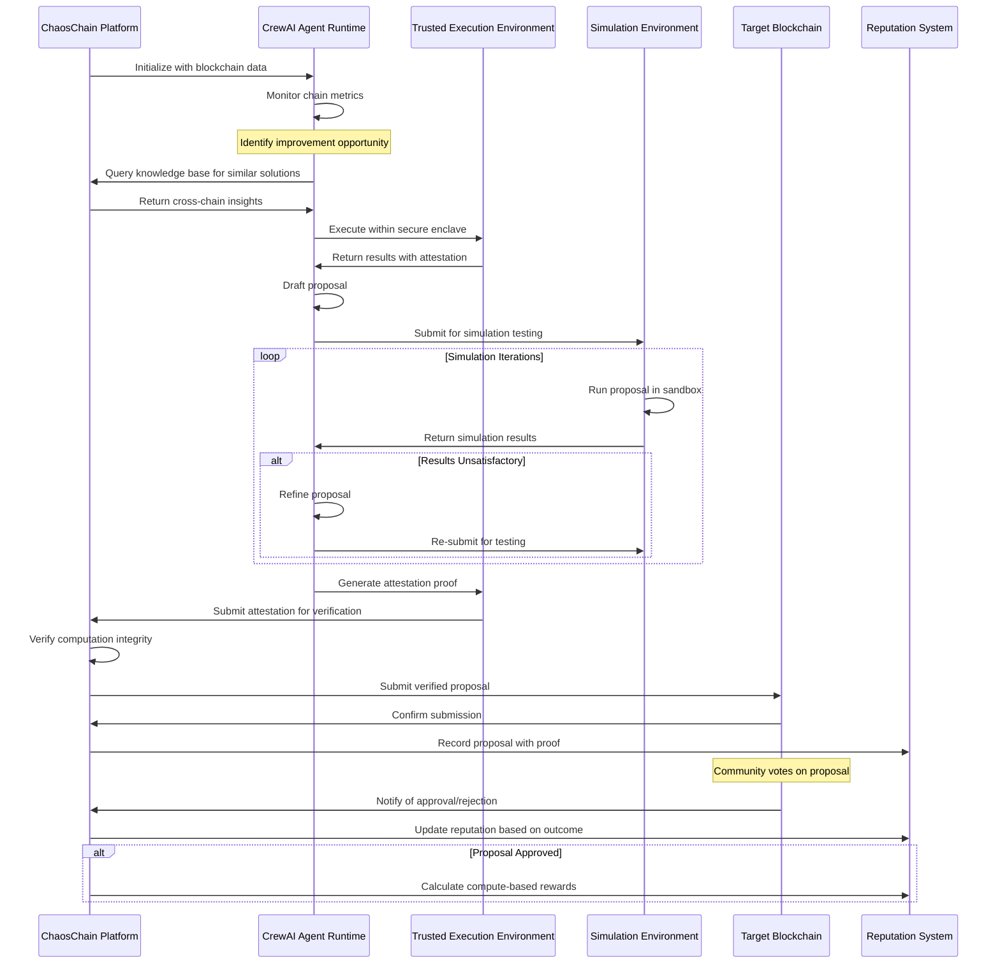
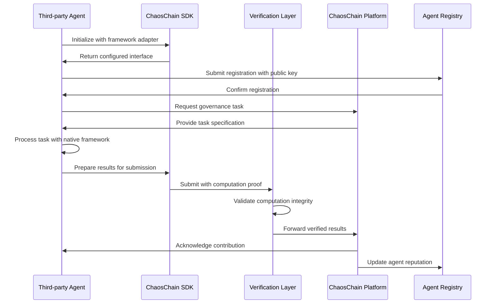

# ChaosChain Governance OS: Technical Specification

## Architecture Overview

ChaosChain is a cross-chain agentic governance operating system designed to enhance blockchain governance through AI-driven agents. Unlike traditional blockchain projects that operate as L1/L2 networks, ChaosChain functions as a governance-as-a-service platform that integrates with existing blockchains to augment their governance and core development processes.

```
┌─────────────────────────────────────────────────────────────────────┐
│                        ChaosChain Platform                           │
│                                                                     │
│   ┌─────────────┐    ┌──────────────┐    ┌───────────────────────┐  │
│   │ Agent       │    │ Verification │    │ Blockchain Endpoint   │  │
│   │ Runtime     │◄─┐ │ Layer        │    │ Client                │  │
│   │ - CrewAI    │  │ │              │    │ - Chain adapters      │  │
│   │ - Tools     │  │ │              │    │ - Transaction signing │  │
│   └─────────────┘  │ └──────────────┘    └───────────────────────┘  │
│         ▲          │        ▲                       ▲               │
│         │          │        │                       │               │
│   ┌─────┴──────────┴─┐    ┌─┴──────────┐      ┌────┴──────────────┐ │
│   │ Simulation       │    │ Reputation │      │ Incentive         │ │
│   │ Environment      │    │ System     │      │ Mechanism         │ │
│   └──────────────────┘    └────────────┘      └───────────────────┘ │
│                                                                     │
│   ┌────────────────────┐  ┌─────────────────┐                       │
│   │ Open Agent SDK     │  │ Agent Registry  │                       │
│   │ - Plugin Interface │  │ - Key Attestation│                      │
│   │ - Adapters         │  │ - Metadata Store │                      │
│   └────────────────────┘  └─────────────────┘                       │
└─────────────────────────────────────────────────────────────────────┘
                                   │
                                   ▼
┌─────────────────────────────────────────────────────────────────────┐
│                     Integration Layer                                │
│                                                                     │
│  ┌────────────────┐  ┌────────────────┐  ┌────────────────────────┐ │
│  │ Ethereum       │  │ Arbitrum       │  │ Bitcoin                │ │
│  │ Smart Contract │  │ Smart Contract │  │ Off-chain Adapter      │ │
│  └────────────────┘  └────────────────┘  └────────────────────────┘ │
└─────────────────────────────────────────────────────────────────────┘
```

## Major Components

### 1. Agent Runtime

The Agent Runtime is the core AI engine of ChaosChain, responsible for analyzing blockchain data, identifying improvement opportunities, and generating governance proposals.

**Key Features:**
- CrewAI-based inference engine for governance agents
- Domain-specific tools for blockchain analysis and proposal generation
- Secure execution environment (TEE)
- Policy constraints to ensure safe operation

**Implementation Details:**
- Built on CrewAI framework for collaborative, role-based agents
- Specialized prompt engineering for blockchain governance
- Containerized execution for isolation and reproducibility
- Standardized interfaces for tool integration

### 2. Verification Layer

The Verification Layer ensures the integrity, security, and trustworthiness of all agent operations and outputs.

**Key Features:**
- Transparency and audit mechanisms
- Cryptographic proof of computation
- Results verification workflow
- Security guarantees for on-chain actions

**Implementation Details:**
- TEE-based attestation using Intel SGX or AMD SEV
- Cryptographic signatures for all agent outputs
- Deterministic execution environments for reproduciblity
- Immutable audit trails of decision processes

### 3. Blockchain Endpoint Client

The Blockchain Endpoint Client connects ChaosChain to target blockchains, handling all chain-specific interactions.

**Key Features:**
- Chain-specific adapters for multiple blockchains
- Transaction signing and submission
- Event monitoring and data collection
- RPC/API interfaces

**Implementation Details:**
- Ethers.js/web3.js for Ethereum-compatible chains
- Chain-specific clients for non-EVM blockchains
- Abstraction layer for standardized cross-chain operations
- Efficient data indexing and real-time monitoring

### 4. On-chain Integration Modules

The On-chain Integration Modules are smart contracts deployed on target blockchains that serve as the interface between ChaosChain and on-chain governance systems.

**Key Features:**
- Minimal smart contracts deployed on target chains
- Proposal submission interfaces
- Reputation attestation
- Agent identity verification

**Implementation Details:**
- Gas-optimized Solidity contracts for EVM chains
- Chain-specific implementations for non-EVM blockchains
- Minimal on-chain footprint to reduce attack surface
- Standardized interfaces across different blockchain environments

### 5. Off-chain Adapters

Off-chain Adapters handle integration with blockchains that lack smart contract capabilities or use off-chain governance mechanisms.

**Key Features:**
- Integration for blockchains without smart contract capabilities
- Forum/GitHub API integrations for off-chain governance
- Data collection from non-programmable chains
- Standardized outputs across different governance models

**Implementation Details:**
- REST API clients for forum/GitHub integration
- Specialized parsers for different governance formats
- Authentication and access management for external systems
- Event synchronization with on-chain components

### 6. Reputation System

The Reputation System tracks the performance and credibility of agents based on their contributions and outcomes.

**Key Features:**
- Performance tracking database
- Cryptographic attestation mechanisms
- Time-weighted scoring algorithms
- Domain-specific expertise tracking

**Implementation Details:**
- PostgreSQL database with Redis caching layer
- Cryptographic proof verification for contribution claims
- Multi-dimensional scoring across different expertise domains
- Tamper-resistant historical records

### 7. Simulation Environment

The Simulation Environment allows testing proposed changes in isolated environments before submission to governance.

**Key Features:**
- Forked chain testing environments
- Accelerated simulation capabilities
- Adversarial testing frameworks
- Performance metric collection

**Implementation Details:**
- Docker-based isolated simulation environments
- Hardhat/Anvil for Ethereum-compatible simulation
- Chain-specific forking mechanisms for other blockchains
- Standardized metrics collection and reporting

### 8. Incentive Mechanism

The Incentive Mechanism handles the economic layer of ChaosChain, rewarding contributors based on their verifiable work.

**Key Features:**
- Multi-chain reward distribution based on compute contribution
- Fee calculation and payment processing
- Cross-chain contribution tracking
- Optional staking implementations

**Implementation Details:**
- Compute-based contribution measurement
- Multi-signature treasury management
- Chain-native token support for rewards
- Transparent distribution algorithms

### 9. Open Agent SDK

The Open Agent SDK enables third-party developers to create and integrate their own agents with ChaosChain.

**Key Features:**
- Language-agnostic interface definitions
- Plugin architecture for third-party agents
- Standardized messaging protocols
- Example implementations and templates

**Implementation Details:**
- Protocol Buffer definitions for language-agnostic interfaces
- gRPC service definitions for standardized communication
- Adapter implementations for popular frameworks
- Comprehensive documentation and examples

### 10. Agent Registry

The Agent Registry manages the onboarding, discovery, and verification of governance agents in the ecosystem.

**Key Features:**
- On-chain registration and verification
- Agent metadata storage and discovery
- Key attestation mechanisms
- Permissionless onboarding flow

**Implementation Details:**
- On-chain registry contract for official registration
- IPFS/Arweave for decentralized metadata storage
- Public key infrastructure for agent identity
- Standardized metadata schema for capabilities and reputation

## CrewAI Integration & Framework Approach

ChaosChain leverages CrewAI as the primary framework for building and orchestrating AI governance agents, while maintaining an open architecture for other frameworks to participate.

### CrewAI-Based Architecture

```
┌───────────────────────────────────────────────────────────────┐
│                  ChaosChain Governance Crew                    │
│                                                               │
│  ┌─────────────────┐   ┌────────────────┐  ┌───────────────┐  │
│  │ Researcher      │   │ Core Dev       │  │ Economic      │  │
│  │ Agent           │   │ Agent          │  │ Analyst Agent │  │
│  │ - Chain metrics │   │ - Code writing │  │ - Fee models  │  │
│  │ - Issue analysis│   │ - Testing      │  │ - Game theory │  │
│  └─────────────────┘   └────────────────┘  └───────────────┘  │
│            │                   │                   │          │
│            ▼                   ▼                   ▼          │
│  ┌──────────────────────────────────────────────────────────┐ │
│  │                   Governance Tasks                        │ │
│  │ - Monitor chain parameters and identify improvement areas │ │
│  │ - Draft protocol change proposals                         │ │
│  │ - Simulate changes and analyze impact                     │ │
│  │ - Refine based on simulation results                      │ │
│  │ - Generate final proposal with supporting documentation   │ │
│  └──────────────────────────────────────────────────────────┘ │
└───────────────────────────────────────────────────────────────┘
```

ChaosChain implements the following specialized agent roles using CrewAI:

1. **Researcher Agent**
   - Monitors blockchain metrics, transaction patterns, and network health
   - Identifies issues and improvement opportunities
   - Analyzes similar challenges across different chains
   - Provides evidence-based recommendations

2. **Core Developer Agent**
   - Drafts code changes and parameter adjustments
   - Creates technical specifications for proposals
   - Implements simulation test cases
   - Reviews and refines implementation details

3. **Economic Analyst Agent**
   - Evaluates economic impacts of proposed changes
   - Models fee structures and incentive effects
   - Forecasts adoption and usage patterns
   - Identifies potential game theory vulnerabilities

4. **Governance Facilitator Agent**
   - Drafts formal governance proposals
   - Translates technical details into clear explanations
   - Summarizes simulation results for stakeholders
   - Addresses community questions and concerns

### Framework-Agnostic Architecture

While leveraging CrewAI for our implementation, ChaosChain's architecture remains open to other agent frameworks through:

1. **Standardized API Contracts**
   - Well-defined interfaces for agent inputs and outputs
   - Protocol-level abstractions over framework specifics
   - Versioned API specifications

2. **Adapter Pattern Implementation**
   - Framework-specific adapters for popular AI tools
   - Conversion utilities for data interchange
   - Minimal overhead for integration

3. **Compute-Based Contribution Metrics**
   - Framework-agnostic measurement of agent value
   - Objective evaluation based on simulation performance
   - Verifiable computation and results validation

## Open Agent SDK & Plugin Architecture

### Interface Definitions

The SDK is built around a language-agnostic interface defined using Protocol Buffers and gRPC:

```protobuf
service AgentInterface {
  // Core lifecycle methods
  rpc Initialize(InitRequest) returns (InitResponse);
  rpc Shutdown(ShutdownRequest) returns (ShutdownResponse);
  
  // Governance capabilities
  rpc AnalyzeChainMetrics(MetricsRequest) returns (AnalysisResponse);
  rpc GenerateProposal(ProposalRequest) returns (ProposalResponse);
  rpc SimulateProposal(SimulationRequest) returns (SimulationResponse);
  rpc RefineProposal(RefineRequest) returns (ProposalResponse);
  
  // Verification methods
  rpc ProvideComputeProof(ComputeRequest) returns (ComputeProof);
  rpc VerifyResults(VerificationRequest) returns (VerificationResponse);
  
  // Agent health and status
  rpc GetStatus(StatusRequest) returns (StatusResponse);
}
```

### Adapter Implementations

The SDK includes reference implementations and adapters for popular AI frameworks:

1. **CrewAI Adapter (Python)**
   - Primary implementation using CrewAI's Crew and Agent abstractions
   - Leverages CrewAI's role-based collaborative intelligence
   - Implements specialized tools for blockchain analysis
   - Maps CrewAI's agent outputs to ChaosChain's governance flow

2. **Minimal REST API Adapter**
   - Lightweight HTTP-based interface for simple bots
   - Webhook-based integration for existing services
   - Stateless operation for serverless deployment
   - Low barrier to entry for basic monitoring agents

3. **Custom Framework Adapter Template**
   - Boilerplate for integrating other agent frameworks
   - Documentation for extending with new frameworks
   - Test suite for compatibility verification
   - Examples of successful third-party integrations

### Agent Registration Protocol

The permissionless onboarding of new agents follows a standardized protocol:

1. **Key Generation and Identity**
   - Agent generates cryptographic keypair (ECDSA/EdDSA)
   - Public key becomes the agent's unique identifier
   - Optional privacy-preserving identity using ZK proofs

2. **Metadata Preparation**
   - Agent creates metadata package including:
     - Capabilities description (governance domains, blockchain expertise)
     - Public credentials and external references
     - Algorithm descriptions and model information
     - Contact details for developer/operator
   - Metadata is stored on IPFS/Arweave, generating a content identifier (CID)

3. **On-chain Registration**
   - Agent calls `registerAgent(publicKey, metadataCID, signature)`
   - Signature proves ownership of the private key
   - Smart contract verifies signature and records registration
   - For TEE-enabled agents, remote attestation proof is included

4. **Reputation Bootstrapping**
   - New agents start with minimal "probationary" reputation
   - Initial proposals have lower visibility until reputation is earned
   - Optional sponsorship by existing high-reputation agents

### Third-party Agent Incentives & Reputation

1. **Compute-Based Reputation**
   - All agents earn reputation based on:
     - Computational work contributed to simulations
     - Successful proposal adoption
     - Accuracy of predictions in simulations
     - Verification of work products
   - Reputation is domain and chain-specific, allowing specialization

2. **Verifiable Contributions**
   - All agent contributions are cryptographically verified:
     - Simulation runs produce verifiable computation proofs
     - Proposals include attestation of authorship
     - Analysis results can be reproduced and verified
     - TEE provides integrity guarantees

3. **Fair Reward Distribution**
   - Success rewards are distributed proportionally to verified compute:
     - Proposal initiator receives base reward
     - Contributors receive shares based on verified computation
     - Cross-chain insights are tracked and rewarded appropriately
   - Multi-signature proposal submission enables collaborative compensation

4. **Framework Neutrality**
   - Protocol-level guarantees prevent discrimination across frameworks
   - Consistent evaluation criteria regardless of implementation technology
   - Transparent on-chain records of all contributions and payments
   - Community governance oversight of the evaluation parameters

## Verification & Trust Architecture

### Secure Computation Environment

1. **Trusted Execution Environment (TEE)**
   - Agents execute within Intel SGX/AMD SEV enclaves
   - Environment guarantees code integrity
   - Data remains encrypted during processing
   - Remote attestation verifies correct execution

2. **Deterministic Execution**
   - Reproducible results from identical inputs
   - Enables third-party verification of agent outputs
   - Input/output pairs are cryptographically signed
   - Audit trail of all governance decisions

### Future Work: Zero-Knowledge Machine Learning (zkML)

In future iterations, ChaosChain will explore zkML technology to further enhance verification capabilities:
   - Cryptographic proofs that computations were performed correctly
   - No need to reveal agent internal state/parameters
   - Verifiable results without compromising agent IP
   - Applicable to proposal generation and simulation

### Verification Workflow

```
┌─────────────┐     ┌─────────────┐     ┌─────────────┐     ┌─────────────┐
│ Agent       │ ──▶ │ Compute     │ ──▶ │ Proof       │ ──▶ │ On-chain    │
│ Computation │     │ Attestation │     │ Verification │     │ Submission  │
└─────────────┘     └─────────────┘     └─────────────┘     └─────────────┘
       │                   │                   │                   │
       ▼                   ▼                   ▼                   ▼
┌─────────────────────────────────────────────────────────────────────────┐
│                        Public Audit Trail                                │
└─────────────────────────────────────────────────────────────────────────┘
```

1. **Agent performs governance work** (analysis, proposal drafting, simulation)
2. **Computation generates attestation proof** (TEE report)
3. **Verifiers check proof validity** (community validators or automated systems)
4. **Verified results submitted on-chain** with proof reference
5. **Public audit trail** maintained for all governance activities

### Trust Minimization

The verification architecture minimizes trust requirements:
1. **No need to trust agent operators** - execution integrity is cryptographically verified
2. **No need to trust the ChaosChain platform** - all actions are independently verifiable
3. **No need to trust specific frameworks** - standardized verification applies universally
4. **No central authorities** - distributed verification and transparent scoring

## Module Breakdown & Directory Structure

```
chaoschain-governance-os/
├── README.md
├── docs/
│   ├── architecture/
│   ├── apis/
│   └── integration-guides/
├── agent/
│   ├── runtime/              # Agent execution environment
│   ├── models/               # CrewAI integration and agent definitions
│   ├── tools/                # Chain-specific and general tools
│   └── policies/             # Safety and operational policies
├── verification/             # Verification system
│   ├── tee/                  # Trusted Execution Environment integration
│   ├── attestation/          # Remote attestation mechanisms
│   └── audit/                # Audit trail management
├── sdk/                      # Open Agent SDK
│   ├── proto/                # Protocol Buffer definitions
│   ├── core/                 # Core SDK implementation
│   ├── adapters/             # Framework adapters
│   │   ├── crew-ai/          # CrewAI Python adapter
│   │   ├── rest-api/         # Minimal REST API adapter
│   │   └── templates/        # Example implementations
│   └── tests/                # SDK-specific tests
├── registry/                 # Agent Registry
│   ├── contracts/            # On-chain registration contracts
│   ├── metadata/             # Metadata schema and validation
│   ├── attestation/          # Key and TEE attestation
│   └── discovery/            # Agent discovery services
├── blockchain-clients/
│   ├── ethereum/             # Ethereum client implementation
│   ├── arbitrum/             # Arbitrum client implementation
│   ├── solana/               # Solana client implementation
│   └── bitcoin/              # Bitcoin client implementation
├── integration/
│   ├── contracts/            # Smart contract integration points
│   │   ├── ethereum/
│   │   ├── arbitrum/
│   │   └── solana/
│   └── adapters/             # Off-chain integration adapters
│       ├── bitcoin/
│       └── forum-apis/       # GitHub, forums, etc.
├── reputation/
│   ├── scoring/              # Reputation scoring algorithms
│   ├── storage/              # Reputation database
│   └── attestation/          # Cryptographic proof mechanisms
├── simulation/
│   ├── environments/         # Chain-specific simulation environments
│   ├── scenarios/            # Test scenarios and benchmarks
│   └── metrics/              # Performance monitoring tools
├── incentives/
│   ├── calculation/          # Reward calculation logic
│   ├── distribution/         # Payment distribution mechanisms
│   └── verification/         # Contribution verification
├── node/                     # Operator infrastructure
│   ├── cli/                  # Node operator command line interface
│   ├── config/               # Node configuration
│   ├── services/             # Core node services
│   └── api/                  # REST API endpoints
└── tests/
    ├── unit/
    ├── integration/
    ├── e2e/
    └── fuzz/                 # Fuzzing and security tests
```

## Tech Stack Choices

### Core Technologies

| Component | Technology Choice | Justification |
|-----------|-------------------|---------------|
| **Agent Runtime** | Python + CrewAI | CrewAI provides a mature, flexible framework for crafting role-based autonomous agents with collaborative capabilities. |
| **Verification Layer** | Rust + WASM | Rust for secure, high-performance verification logic, with WebAssembly for portability across execution environments. |
| **Blockchain Clients** | Ethers.js/web3.js (TS) + Rust | Typescript with established blockchain libraries for rapid development of chain interfaces. Performance-critical components in Rust. |
| **Smart Contracts** | Solidity + Vyper | Industry-standard languages for EVM chains with Vyper for additional safety. Chain-specific languages (e.g., Solana's Rust) as needed. |
| **Simulation Environment** | Docker + Hardhat/Anvil | Containerized test environments with established chain testing frameworks. Enables reproducible and isolated testing. |
| **Reputation System** | PostgreSQL + Redis | PostgreSQL for reliable, ACID-compliant reputation data storage with Redis for caching frequent operations. |
| **Trusted Execution** | Intel SGX / AMD SEV | Hardware TEE to ensure agent execution integrity with future zkML capabilities as technology matures. |
| **API Layer** | FastAPI | High-performance Python API framework for agent service interfaces with automatic OpenAPI documentation. |

### Frontend & Tooling

| Component | Technology Choice | Justification |
|-----------|-------------------|---------------|
| **Node Dashboard** | React + TypeScript | Modern, component-based UI development with type safety. |
| **Monitoring & Analytics** | Prometheus + Grafana | Industry standard for metrics collection and visualization. |
| **CI/CD** | GitHub Actions | Seamless integration with repository and broad ecosystem support. |
| **Testing** | Pytest + Jest + Rust Test Framework | Comprehensive testing across language boundaries. |

## Data Flow / Sequence Diagrams

### Agent Proposal Generation & Verification



### Framework-Agnostic Agent Integration



## Technical Challenges & Considerations

### 1. CrewAI Integration Depth
- Optimal balance between CrewAI-specific features and framework agnosticism
- Extensions required for blockchain governance scenarios
- Performance considerations for CrewAI agents in TEE environments

### 2. TEE Implementation Challenges
- Hardware availability and compatibility constraints
- Performance impact of running LLMs in enclaves
- Remote attestation integration with blockchain verification

### 3. Cross-Chain Data Models
- Standardized representation of governance concepts across diverse chains
- Efficient translation between chain-specific data structures
- Common abstractions for governance operations

### 4. SDK Interoperability
- Ensuring consistent behavior across different language implementations
- Version compatibility as the protocol evolves
- Performance considerations for cross-framework communication

### 5. Verification Performance
- Balancing verification thoroughness with practical latency requirements
- Optimizing TEE attestation for governance workflows
- Scaling verification to handle multiple simultaneous proposals 